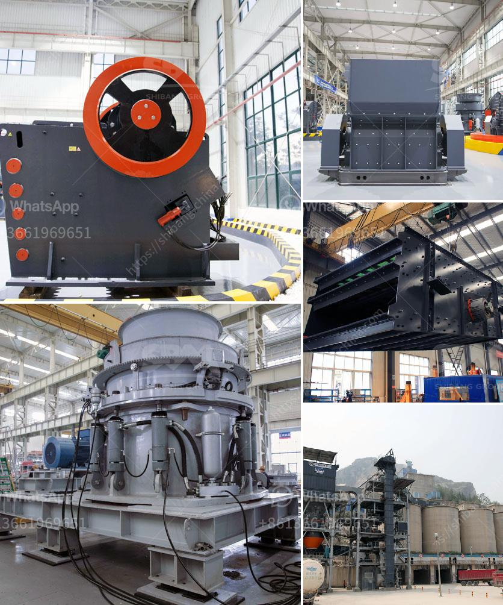

<h3>feed mill manufacturer in davao</h3>
Davao City is not only known for its bustling economy and beautiful landscapes, but also for its thriving agriculture industry. One of the crucial aspects of this industry is the production of high-quality animal feeds, which greatly affects the health and productivity of livestock. This is where feed mill manufacturers in Davao play a vital role.

Feed mill manufacturers in Davao are responsible for producing livestock and poultry feeds that ensure the well-being and growth of animals. They carefully select and process ingredients such as grains, soybean meal, corn, and vitamins and minerals to create nutritionally balanced feeds. These manufacturers prioritize the quality and consistency of their products to meet the specific dietary requirements of various animals.

One of the key advantages of choosing a feed mill manufacturer in Davao is their proximity to local farms. Being locally based allows for quick and efficient delivery of feeds, ensuring their freshness and optimal condition upon consumption. This is particularly important in maintaining the nutritional value of the feeds, as any delay or mishandling during transportation can compromise its quality.

In addition, feed mills in Davao adhere to strict quality control measures. They invest in state-of-the-art equipment and employ skilled technicians who monitor the production process closely. From ingredient selection and grinding to mixing and packaging, every step undergoes rigorous testing and inspection to guarantee superior quality feeds.

Moreover, Davao's feed mill manufacturers continuously innovate and improve their production techniques. They stay updated with the latest research and technology advancements in animal nutrition, allowing them to develop feeds that meet the evolving needs of the industry. This commitment to innovation and constant improvement sets these manufacturers apart, making their products highly sought-after in the market.

Overall, feed mill manufacturers in Davao play an integral role in sustaining the growth and productivity of the agriculture industry. Their dedication to producing high-quality feeds and their commitment to continuous improvement contribute to the success of local farms and the overall development of the region. With their expertise and quality products, Davao's feed mill manufacturers are undoubtedly driving the industry forward and ensuring the welfare of livestock.
<h3>Contact us</h3><ul><li><strong>Whatsapp:&nbsp;<a href="https://wa.me/8613661969651">+8613661969651</a></strong></li><li><a href="https://swt.shibang-china.com/?git&amp;zhl&amp;feed mill manufacturer in davao"><strong>Online Service(chat now)</strong></a></li></ul><h3>Related</h3><ul><li><a href='vertical shaft impact crushers.md'>vertical shaft impact crushers</a></li><li><a href='trommel wash plant suppliers pakistan.md'>trommel wash plant suppliers pakistan</a></li><li><a href='iron crusher supplier.md'>iron crusher supplier</a></li><li><a href='sand and gravel crusher.md'>sand and gravel crusher</a></li><li><a href='linear vibrating screen specifications.md'>linear vibrating screen specifications</a></li></ul>