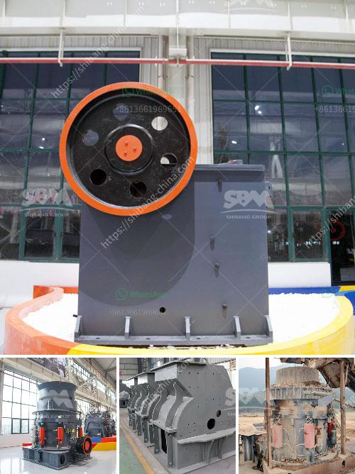

<h3>feldspar crusher price</h3>
Feldspar is a common mineral found in many types of rocks, particularly in igneous and metamorphic rocks. It is primarily composed of aluminum silicate minerals including potassium, sodium, and calcium. As a key mineral in the Earth's crust, feldspar has a wide range of applications, including in the production of glass, ceramics, and paints.

When it comes to processing feldspar, crushers are indispensable equipment. Typically, jaw crusher is used in the primary crushing, and the impact crusher is used in the secondary crushing. Usually, according to the quarry conditions, mobile crushers are also used in the feldspar quarrying.

To choose the suitable feldspar crusher, it is necessary to be familiar with the properties of feldspar. The hardness of feldspar is typically 6-6.5 on the Mohs scale, which indicates moderate hardness and good workability. In addition, it has low silicate content, and its glassy phase starts at about 1300°C, making it suitable for applications in the glass and ceramics industries.

Price is always an important factor affecting customers' purchasing decisions. However, the price of feldspar crusher is influenced by various factors such as market demand, region, and manufacturer's brand. This means that the price of a feldspar crusher varies greatly.

With the rapid development of the mining industry, the demand for feldspar crushers has increased significantly, resulting in a surge in market prices. Nowadays, there are many manufacturers available in the market, and their prices are also diverse. Therefore, to find a suitable feldspar crusher with a reasonable price is not an easy task.

FTM Machinery, a leading manufacturer of mining machinery, has been focusing on the production of stone crushers for 40 years. It has rich experience, mature technology, and enjoys a high reputation in the industry. Therefore, FTM Machinery can provide customers with high-quality equipment and the best quotation, as well as fast delivery and installation service.

In summary, the price of feldspar crusher is influenced by various factors. The purchasing decision should be made after considering the market demand, the region, and the manufacturer's brand. FTM Machinery is a reliable manufacturer with long history and good reputation, and the high-quality equipment produced by it can bring greater benefits to customers in the long run.
<h3>Contact us</h3><ul><li><strong>Whatsapp:&nbsp;<a href="https://wa.me/8613661969651">+8613661969651</a></strong></li><li><a href="https://swt.shibang-china.com/?git&amp;zhl&amp;feldspar crusher price"><strong>Online Service(chat now)</strong></a></li></ul><h3>Related</h3><ul><li><a href='materials vibrating feeder.md'>materials vibrating feeder</a></li><li><a href='enquiry about stone crusher.md'>enquiry about stone crusher</a></li><li><a href='chromite ore flowsheet pdf.md'>chromite ore flowsheet pdf</a></li><li><a href='rock crushing and ballast.md'>rock crushing and ballast</a></li><li><a href='enquiry jaw crusher.md'>enquiry jaw crusher</a></li></ul>