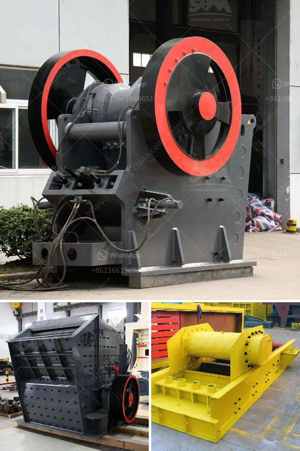

<h3>feldspar grinding plant</h3>
Feldspar is a common rock-forming mineral found in abundance in the Earth's crust. It is a crucial industrial mineral used primarily in ceramics and glass manufacturing, but it also has numerous other applications across a wide range of industries. To meet the growing demand for feldspar, a dedicated processing plant is required, where the mineral can be ground into various sizes to suit different applications.

A feldspar grinding plant is a significant investment project. Far more capital intensive than the average mineral processing facility, the plant requires a large number of workers and substantial infrastructure. The equipment used to grind the raw material into fine particles typically involves various types of crushers, among which jaw crushers, impact crushers, and cone crushers are commonly used. After the initial crushing stage, ball mills or rod mills are commonly utilized to grind the feldspar into smaller particles.

The main challenge in setting up a feldspar grinding plant lies in achieving the desired product specifications while controlling the production cost. The specific requirements of the end-users, such as particle size distribution, chemical composition, and mineral purity, must be met to ensure the marketability of the final product. Additionally, energy consumption in the grinding process must be optimized to minimize production costs.

In recent years, advanced technology and equipment have greatly facilitated feldspar grinding plant operations. Automation systems can be employed to monitor and control the entire production process, improving efficiency and consistency. High-pressure grinding rolls (HPGR) have also emerged as an alternative to traditional grinding mills, offering potential energy savings and improved product quality.

Furthermore, in order to reduce the environmental impact associated with traditional grinding processes, plant operators can implement various sustainability measures. These may include utilizing renewable energy sources, implementing water recycling systems, and optimizing waste management strategies. By adopting green practices, a feldspar grinding plant can enhance its reputation, attract socially responsible customers, and contribute to the overall sustainability of the industry.

Market demand for feldspar is expected to continue to grow due to its vast range of applications. The mineral is used in the production of porcelain and ceramic tiles, sanitaryware, glass, and fiberglass. It is also utilized in the manufacturing of enamels, glazes, and abrasives, as well as being a key ingredient in paint, plastics, and rubber. As such, establishing a feldspar grinding plant can provide a lucrative business opportunity for investors.

In conclusion, a feldspar grinding plant plays a vital role in the processing of this versatile mineral. By transforming raw feldspar into fine particles, the plant enables the creation of a wide range of products used in various industries. With advanced technology, a commitment to sustainability, and a market-oriented approach, a feldspar grinding plant can thrive in today's competitive market landscape.
<h3>Contact us</h3><ul><li><strong>Whatsapp:&nbsp;<a href="https://wa.me/8613661969651">+8613661969651</a></strong></li><li><a href="https://swt.shibang-china.com/?git&amp;zhl&amp;feldspar grinding plant"><strong>Online Service(chat now)</strong></a></li></ul><h3>Related</h3><ul><li><a href='best china brand crushing plant.md'>best china brand crushing plant</a></li><li><a href='full quarry machines for sale in china.md'>full quarry machines for sale in china</a></li><li><a href='magnetic iron ore processing plant cost.md'>magnetic iron ore processing plant cost</a></li><li><a href='stone crusher bahan bakar.md'>stone crusher bahan bakar</a></li><li><a href='cost of barite in the nigeria market.md'>cost of barite in the nigeria market</a></li></ul>