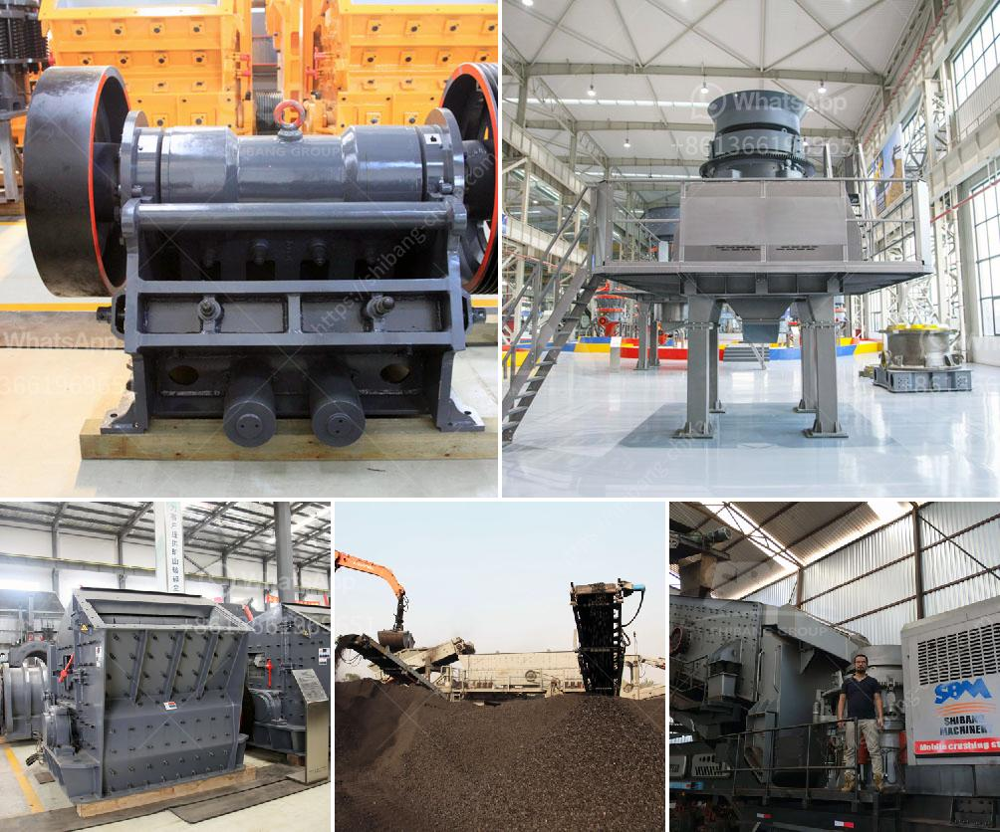

<h3>feldspar powder making</h3>
Feldspar is a common mineral found in many parts of the world. It is a vital ingredient in various industries due to its unique properties and versatility. One of the essential applications of feldspar is in the production of feldspar powder, which is extensively used in the manufacturing of ceramics, glass, and other materials.

Feldspar is a group of aluminosilicate minerals that contain varying amounts of potassium, sodium, and calcium. The mineral is generally found in large igneous rocks called plutons. It is extracted from these rocks through mining processes and further processed to obtain feldspar powder.

The process of making feldspar powder starts with the extraction of the mineral from the earth's crust. This usually involves mining operations, which can be both underground and open-pit mining, depending on the location and accessibility of the feldspar deposits. Once the feldspar ore is extracted from the ground, it is transported to the processing plant.

The processing plant is equipped with various crushing and grinding equipment to break down the large chunks of feldspar into a fine powder. The initial step in the process is crushing. The mined ore is fed into a jaw crusher, which reduces the size of the rocks to smaller pieces. The crushed material is then further pulverized using a ball mill or a rod mill, depending on the required fineness.

After grinding, the feldspar powder undergoes a process called flotation. During this step, the powdered material is mixed with water and various chemicals to selectively separate the feldspar from impurities such as iron and titanium oxides. The froth floatation process enables the separation of feldspar from unwanted minerals, improving the purity and quality of the final product.

Once the feldspar powder is separated from impurities, it is dried and stored for packaging and distribution. The powder is packed in bags or containers, ready to be shipped to industries that require feldspar as a raw material.

The uses of feldspar powder are vast and varied. In the ceramic industry, feldspar powder is a crucial ingredient used to make ceramic glazes, tiles, and tableware. It acts as a flux, which helps in reducing the melting point of ceramics and enhances their strength and durability. The powder also imparts desirable properties such as whiteness and translucency to the finished ceramic products.

In the glass industry, feldspar powder is used as a fluxing agent in the manufacturing of glass products. It helps in reducing the melting temperature of glass, improving its workability, and enhancing the overall quality of the glassware. Feldspar powder is also used in the production of insulation materials, abrasive materials, and paints, among other applications.

In conclusion, feldspar powder plays a vital role in various industries, including ceramics and glass manufacturing. The process of making feldspar powder involves mining, crushing, grinding, and flotation to obtain a pure and high-quality product. This versatile mineral powder is extensively used in the production of ceramics, glass, and other materials, contributing to the growth and development of numerous industries worldwide.
<h3>Contact us</h3><ul><li><strong>Whatsapp:&nbsp;<a href="https://wa.me/8613661969651">+8613661969651</a></strong></li><li><a href="https://swt.shibang-china.com/?git&amp;zhl&amp;feldspar powder making"><strong>Online Service(chat now)</strong></a></li></ul><h3>Related</h3><ul><li><a href='aggregates crusher plant for sale in south africa.md'>aggregates crusher plant for sale in south africa</a></li><li><a href='crushing of coal process.md'>crushing of coal process</a></li><li><a href='mobile stone crusher plant.md'>mobile stone crusher plant</a></li><li><a href='europe quartz stone machinery factory.md'>europe quartz stone machinery factory</a></li><li><a href='how much is gold hammer mill crusher.md'>how much is gold hammer mill crusher</a></li></ul>