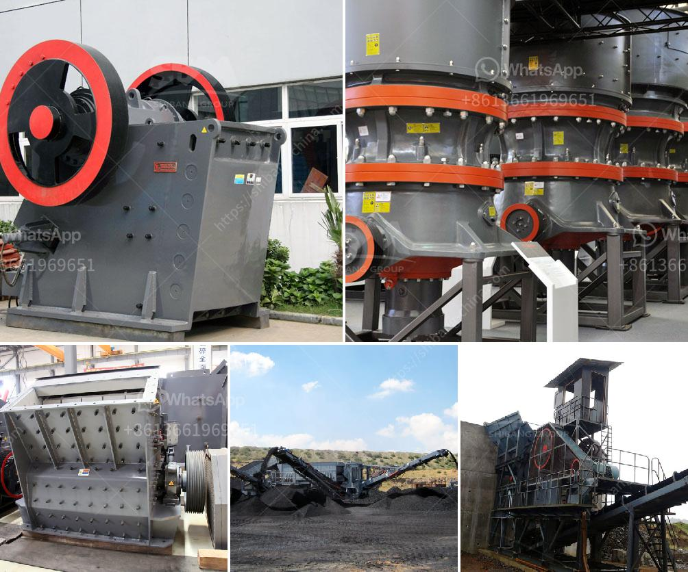

<h3>financial statements of miningpanies</h3>
Mining companies play a significant role in the global economy, extracting valuable resources to fuel various industries. These companies are often large, complex organizations with extensive operations, making it crucial to understand their financial position and performance. Financial statements are key tools used by investors, analysts, and stakeholders to evaluate the health and profitability of mining companies. In this article, we will explore the importance of financial statements and the key insights they provide, focusing on three main statements: the balance sheet, income statement, and cash flow statement.

The balance sheet offers a snapshot of a mining company's financial condition at a specific point in time. It presents information on a company's assets, liabilities, and shareholders' equity. Understanding a mining company's asset base, including its mineral reserves and property, plant, and equipment, is pivotal. Investors can gauge the company's ability to generate future revenue based on these assets. Meanwhile, liabilities and equity indicate the sources of funding and the financial obligations the company has. Analyzing these figures can provide insights into the company's leverage and solvency.

The income statement provides a comprehensive overview of a mining company's revenues, expenses, gains, and losses over a specific period. Key components include revenues from the sales of extracted minerals, operating expenses, depreciation, and exploration costs. Mining companies are capital-intensive, and tracking these expenses is crucial to assess cost efficiency. The income statement also highlights the company's operating income and net income, indicating profitability. By comparing these figures to industry benchmarks, investors can assess a mining company's financial performance and growth potential.

The cash flow statement reveals the mining company's cash inflows and outflows during a specific period. Within this statement, there are three sections: operating activities, investing activities, and financing activities. Operating activities involve cash flows generated from the company's core mining operations. It provides insights into the company's ability to generate consistent cash flows. Investing activities focus on cash flows related to capital expenditures, exploration activities, and acquisitions. This section helps assess the company's investment strategy and future growth prospects. Lastly, financing activities illustrate cash inflows and outflows related to debt and equity financing. Monitoring these activities can help determine the company's capital structure and financial health.

Analyzing the financial statements of mining companies is essential for investors and stakeholders to make informed decisions. These statements provide a comprehensive view of the company's financial health, performance, and potential for growth. By examining the balance sheet, income statement, and cash flow statement, analysts can evaluate the company's asset base, profitability, cost efficiency, liquidity, and financing strategies. However, it's essential to consider industry-specific factors such as commodity prices, regulatory challenges, and environmental obligations that can impact the financial statements. Regularly reviewing these statements allows investors to stay updated on the mining industry's ever-changing dynamics and make sound investment decisions.
<h3>Contact us</h3><ul><li><strong>Whatsapp:&nbsp;<a href="https://wa.me/8613661969651">+8613661969651</a></strong></li><li><a href="https://swt.shibang-china.com/?git&amp;zhl&amp;financial statements of miningpanies"><strong>Online Service(chat now)</strong></a></li></ul><h3>Related</h3><ul><li><a href='hydraulic control for jaw crusher.md'>hydraulic control for jaw crusher</a></li><li><a href='100tpd gold processing plant.md'>100tpd gold processing plant</a></li><li><a href='mining wash plant price.md'>mining wash plant price</a></li><li><a href='quarry crusher machine equipment in germany prices.md'>quarry crusher machine equipment in germany prices</a></li><li><a href='crusher for sale philippines.md'>crusher for sale philippines</a></li></ul>