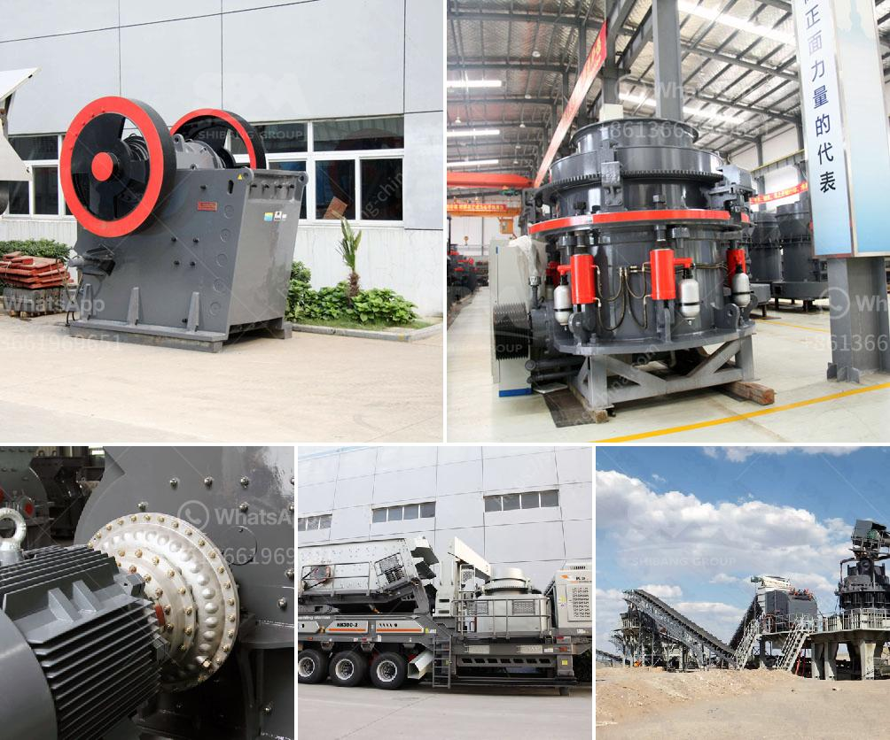

<h3>fine cone crusher</h3>
A cone crusher is a versatile machine that is commonly used for secondary or tertiary crushing of hard rock materials. Its main function is to reduce the size of these materials to enable them to be processed in various industries such as construction, mining, and aggregate. One type of cone crusher that stands out in terms of performance and efficiency is the fine cone crusher.

Fine cone crushers are designed with the goal of maximizing the production of high-quality end products. These machines are equipped with advanced technology and features that allow them to crush finer particles and produce a more uniform product shape. They are typically used in applications where the feed material is finer and harder, requiring a higher reduction ratio.

One of the key advantages of using a fine cone crusher is its ability to control the size of the particles being crushed. With a wide range of adjustable eccentric throw settings, operators can easily regulate the size of the output material. This flexibility is particularly useful in industries that require specific particle sizes, such as concrete and asphalt production.

Another crucial feature of fine cone crushers is their ability to maintain a consistent product shape. These machines utilize a special crushing chamber design that ensures the material is uniformly crushed and shaped. This is especially important in the production of high-quality aggregates, as a uniform shape enhances the overall performance of the end product.

In addition to superior particle size control and product shape, fine cone crushers offer several other benefits. They are known for their high crushing efficiency, which translates into lower operating costs and improved overall productivity. The advanced hydraulic system allows for quick and easy adjustments, reducing downtime and maximizing uptime.

Moreover, fine cone crushers are designed with durability in mind. They are built to withstand heavy-duty applications and harsh operating conditions, ensuring reliable operation and long service life. The robust construction and premium-quality components make these machines capable of handling even the most demanding crushing tasks.

When it comes to fine cone crushers, one model that stands out is the XYZ Fine Cone Crusher. With its cutting-edge technology and innovative design, this machine delivers exceptional performance and productivity. It is equipped with XYZ's patented XYZdrive™ system, which ensures smooth and efficient operation.

The XYZ Fine Cone Crusher also features an adjustable crushing chamber, allowing operators to optimize the performance based on the specific application requirements. Its automated control system further enhances the ease of operation and ensures consistent performance.

In conclusion, fine cone crushers are indispensable tools in the crushing industry. Their ability to control particle size, maintain product shape, and deliver high crushing efficiency makes them ideal for a wide range of applications. With advanced technology and robust construction, these machines offer reliable and efficient operation, ultimately resulting in enhanced productivity and profitability.
<h3>Contact us</h3><ul><li><strong>Whatsapp:&nbsp;<a href="https://wa.me/8613661969651">+8613661969651</a></strong></li><li><a href="https://swt.shibang-china.com/?git&amp;zhl&amp;fine cone crusher"><strong>Online Service(chat now)</strong></a></li></ul><h3>Related</h3><ul><li><a href='concrete crusher price philippines.md'>concrete crusher price philippines</a></li><li><a href='jaw crusher grinding.md'>jaw crusher grinding</a></li><li><a href='industrial mining jaw crushers south africa.md'>industrial mining jaw crushers south africa</a></li><li><a href='financial statements of miningpanies.md'>financial statements of miningpanies</a></li><li><a href='limestone crusher machine price.md'>limestone crusher machine price</a></li></ul>