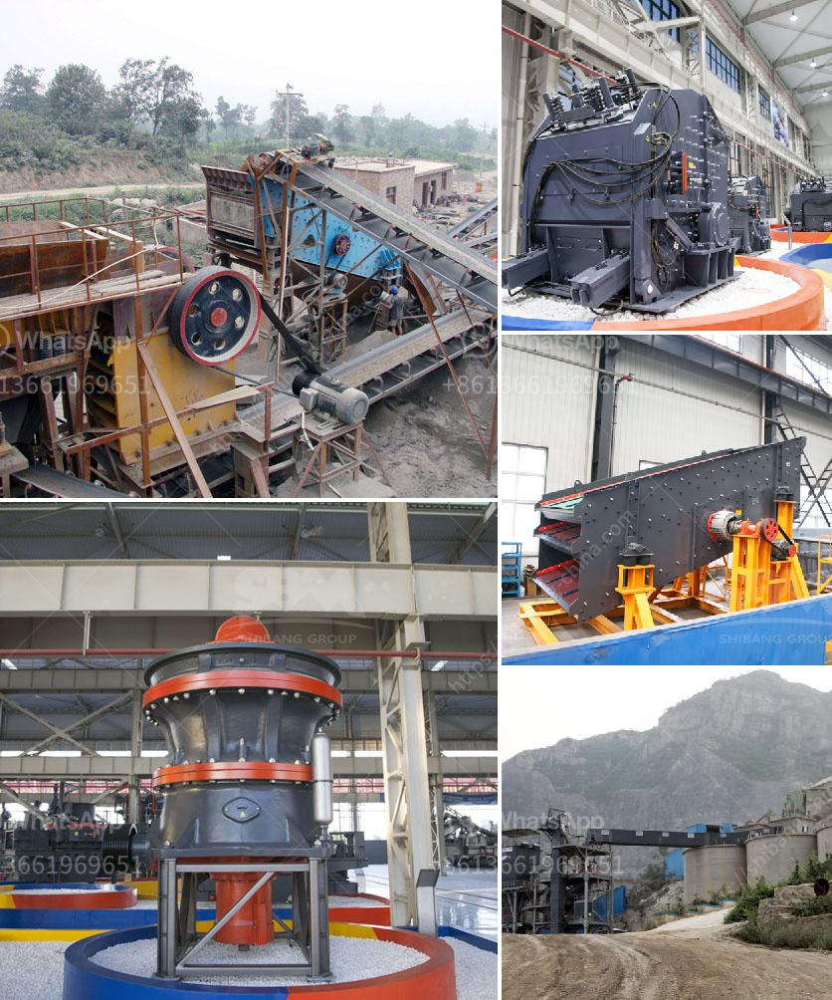

<h3>fine grinding mills</h3>
Fine grinding mills are used for processing a diverse range of materials, including food products, minerals, pharmaceuticals, pigments, and various chemicals. These mills are efficient in grinding materials down to a predetermined particle size, ensuring consistent and homogeneous results.

One key benefit of fine grinding mills is their ability to produce finely ground particles, achieving a narrow particle size distribution. This is essential in industries where uniformity is critical, such as in the production of powdered food products or pharmaceuticals. By controlling the size of the particles, manufacturers can ensure their products meet the desired specifications and perform optimally.

Fine grinding mills utilize various grinding mechanisms, such as impact, compression, and attrition, to achieve the desired particle size reduction. Depending on the material being processed and the desired end product, different mill designs and configurations are employed. Some common types of fine grinding mills include ball mills, stirred mills, and jet mills.

In addition to achieving the desired particle size, fine grinding mills offer several other advantages. Firstly, they often operate at lower power consumption compared to traditional grinding mills, making them energy efficient and cost-effective. Additionally, some mills offer the flexibility to adjust the grinding parameters and settings according to specific needs, ensuring optimal processing conditions.

Fine grinding mills are also equipped with advanced control systems, allowing operators to monitor and adjust various parameters in real-time. This enables efficient operation and helps to minimize downtime, ultimately increasing productivity and profitability.

Overall, fine grinding mills play a crucial role in various industries, providing efficient and precise particle size reduction. These mills have the capacity to process a wide range of materials, produce uniform and homogenous particles, and operate with exceptional energy efficiency. With their advanced control systems, they offer flexibility and precision in achieving desired processing conditions. As industries continue to demand higher quality and consistency, fine grinding mills are set to remain an indispensable tool for manufacturers worldwide.
<h3>Contact us</h3><ul><li><strong>Whatsapp:&nbsp;<a href="https://wa.me/8613661969651">+8613661969651</a></strong></li><li><a href="https://swt.shibang-china.com/?git&amp;zhl&amp;fine grinding mills"><strong>Online Service(chat now)</strong></a></li></ul><h3>Related</h3><ul><li><a href='aggregate crusher plant price.md'>aggregate crusher plant price</a></li><li><a href='used jaw crushers from oman.md'>used jaw crushers from oman</a></li><li><a href='crusher plant operator in crusher.md'>crusher plant operator in crusher</a></li><li><a href='material of mantles ball mills.md'>material of mantles ball mills</a></li><li><a href='jaw crusher ghana quarry plant.md'>jaw crusher ghana quarry plant</a></li></ul>