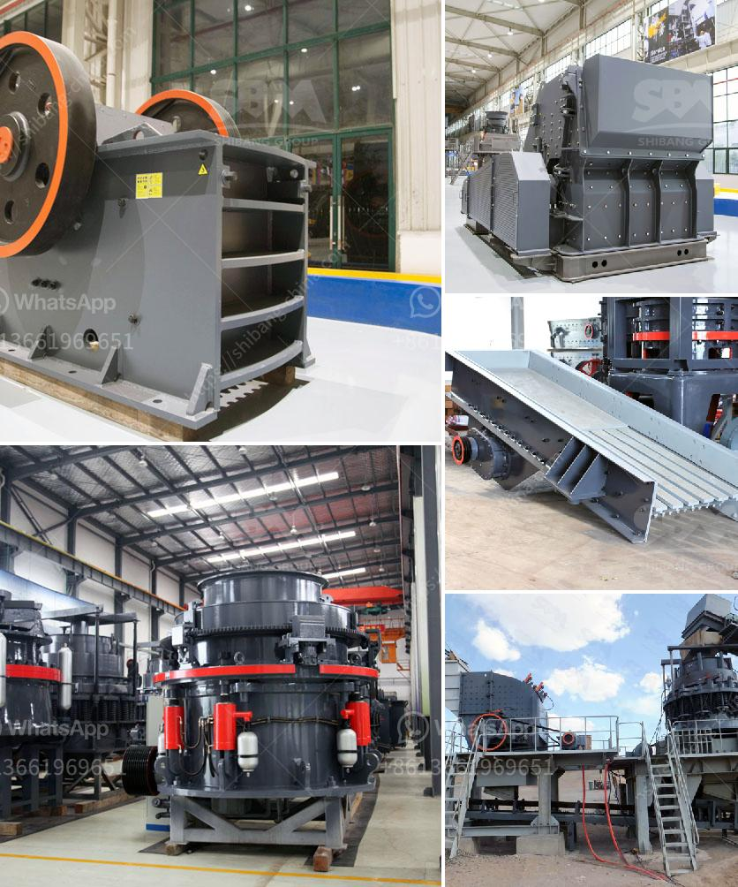

<h3>flow chart of three stage agreegate crushing plant</h3>
A flow chart is a visual representation of the steps or actions that need to be taken to achieve a desired outcome. In the case of a three-stage aggregate crushing plant, the process involves several stages, including feeding, crushing, and screening. To simplify this process for our readers, we will present a flow chart of a typical three-stage aggregate crushing plant, starting with the initial stage of material extraction.

The first stage of the aggregate crushing process involves the extraction of raw materials from the earth. These materials, known as aggregates, can be obtained from natural sources such as sand and gravel pits or quarries. The flow chart starts with the excavation of the raw materials using heavy-duty machinery, such as loaders or excavators. The extracted materials are then transported to a primary crusher, where they will begin the crushing process.

Once the raw materials have been extracted, they undergo primary crushing. In this stage, the raw materials are fed into the primary crusher, which can be either a jaw crusher or an impact crusher. The primary crusher is responsible for reducing the size of the raw materials to a manageable size. After the crushing process, the materials are then conveyed to the next stage through a conveyor belt.

In the secondary crushing stage, the materials from the primary crusher are further crushed to achieve the desired size. This stage usually involves the use of a cone crusher or an impact crusher. The cone crusher is designed to break down the hard and abrasive materials, while the impact crusher is used to crush soft materials. Depending on the desired final product, the secondary crushing stage may involve multiple crushers before the materials are conveyed to the next stage.

The final stage of the aggregate crushing process is screening. In this stage, the crushed materials are separated into different sizes using screens. The purpose of screening is to ensure that the final product meets the required specifications. The screens used in this stage can vary in size and configuration depending on the desired final product. Oversized materials are fed back into the crushing circuit for further processing, while the correctly sized materials are sent to the next stage or to storage for future use.

A three-stage aggregate crushing plant is a complex and intricate process that requires the right equipment and design to ensure the efficiency and productivity of the operation. With the help of a flow chart, the process of extracting, crushing, and screening raw materials to obtain the desired final product can be more easily understood and visualized. Each stage in the process plays a crucial role in achieving the desired outcome, and proper planning and execution are essential for a successful aggregate crushing plant.
<h3>Contact us</h3><ul><li><strong>Whatsapp:&nbsp;<a href="https://wa.me/8613661969651">+8613661969651</a></strong></li><li><a href="https://swt.shibang-china.com/?git&amp;zhl&amp;flow chart of three stage agreegate crushing plant"><strong>Online Service(chat now)</strong></a></li></ul><h3>Related</h3><ul><li><a href='stone crushing plant in pakistan.md'>stone crushing plant in pakistan</a></li><li><a href='models and prices of vibrating screens.md'>models and prices of vibrating screens</a></li><li><a href='cement clinker grinding plant cost.md'>cement clinker grinding plant cost</a></li><li><a href='crushing machine manufacturers china.md'>crushing machine manufacturers china</a></li><li><a href='quarry crusher machine equipment in germany prices.md'>quarry crusher machine equipment in germany prices</a></li></ul>