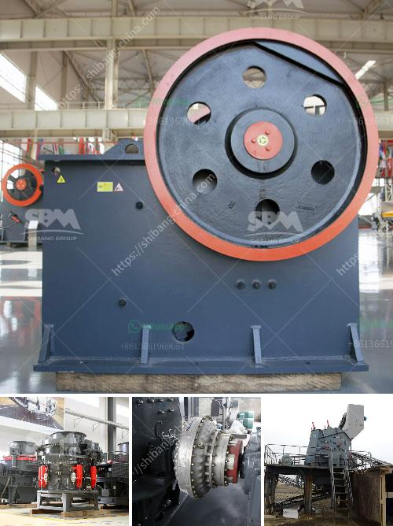

<h3>flowchart diagram for cement plant</h3>
Flowcharts are widely used in industries to streamline operations and ensure efficient processes. In the cement manufacturing process, flowcharts are an excellent tool to identify process problems and find ways to optimize the production process. This article introduces the flowchart diagram for a typical cement plant and discusses the various processes involved in cement manufacturing.

To begin with, a flowchart is a graphical representation of a sequence of operations or steps. In the cement industry, flowcharts are used to describe the key production activities, from raw materials preparation to the final product manufacturing and dispatch.

The first step in the cement manufacturing process is acquiring the raw materials. These usually include limestone, clay, shale, and silica. The raw materials are extracted from quarries or mines and transported to the cement plant. Once at the plant, the materials are crushed and blended to create the homogeneous mixture required for cement production.

The next step in the process is the preheating and calcination of the raw materials. In this stage, the crushed materials are heated in a rotary kiln to drive off the excess moisture and chemically convert them into a product known as clinker. The clinker is then cooled and stored for further processing.

After the clinker is cooled, it is ground into a fine powder called cement. This grinding process accounts for a significant portion of the energy used in cement production. However, it is necessary to produce cement with the desired properties. The grinding process is usually performed in ball mills, which are large rotating cylinders partially filled with steel balls.

The final step in the cement manufacturing process is the packaging and dispatching of the finished product. Cement bags are filled with the finely ground cement powder and sealed to prevent moisture absorption. The bags, typically weighing around 50 kg, are then stacked on pallets and transported to warehouses or directly to customers.

A flowchart diagram for a cement plant can be easily created using online software or flowcharting tools. There are several flowchart templates available that can be customized to suit the specific requirements of a cement manufacturing plant. The flowchart will typically consist of various shapes and arrows that represent each step in the process. The shapes may include rectangles for processes, diamonds for decision points, and arrows to indicate the flow of materials or information.

By using flowcharts in cement manufacturing, plant operators and managers can get a visual representation of the entire process. This helps identify bottlenecks, delays, or other problems in the production line. With this information, they can make informed decisions on process improvements or changes that can increase efficiency and reduce costs.

In conclusion, flowchart diagrams are valuable tools in the cement manufacturing process. They provide a concise and clear representation of the various steps involved in cement production, from raw material acquisition to the dispatch of the final product. By utilizing flowcharts, cement plants can identify areas for improvement and optimize their operations to meet customer demands efficiently.
<h3>Contact us</h3><ul><li><strong>Whatsapp:&nbsp;<a href="https://wa.me/8613661969651">+8613661969651</a></strong></li><li><a href="https://swt.shibang-china.com/?git&amp;zhl&amp;flowchart diagram for cement plant"><strong>Online Service(chat now)</strong></a></li></ul><h3>Related</h3><ul><li><a href='wet wet grinding mills.md'>wet wet grinding mills</a></li><li><a href='crusher for cobble.md'>crusher for cobble</a></li><li><a href='nigeria vertical mill machine.md'>nigeria vertical mill machine</a></li><li><a href='gold mining machinery.md'>gold mining machinery</a></li><li><a href='mining process of marble crusher.md'>mining process of marble crusher</a></li></ul>