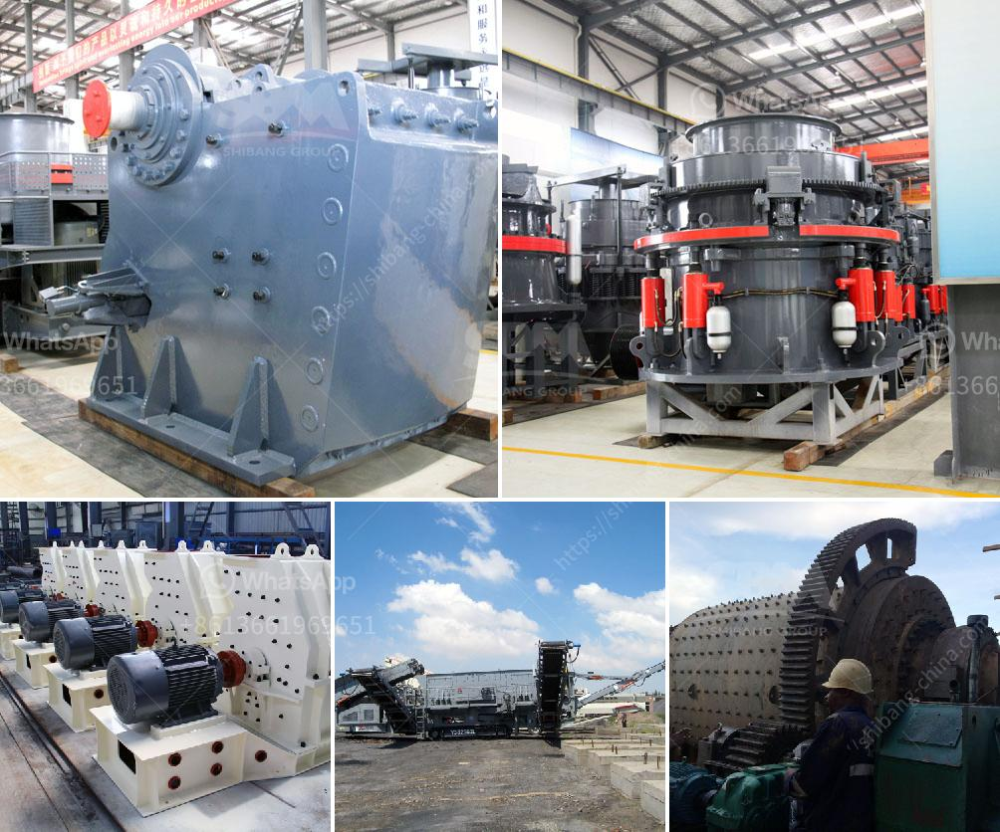

<h3>flowchart of a stone crushing plant</h3>
A stone crushing plant is a crucial machinery for ore mining and processing. In order to achieve the optimal processing capacity and efficiency, the flow chart of crushing plant is crucial for the mining operations. If you need to know the detailed flow chart of the stone crushing plant, please follow the information below.

The flowchart of a stone crushing plant includes vibrating feeder, primary jaw crusher, secondary cone crusher or impact crusher, vibrating screen, belt conveyors, and control system. Firstly, large stones are evenly and gradually conveyed into jaw crusher through a vibrating feeder for primary crushing. The coarsely crushed stones are conveyed through belt conveyors to the second step of secondary crushing.

In the secondary crushing stage, either cone crusher or impact crusher can be used. Cone crusher is high capacity and efficiency crushing equipment, which has a longer lifespan compared to impact crusher. However, impact crusher has a higher reduction ratio and can better control the output size. Both machines can meet different production requirements.

After the secondary crushing stage, the stones will be screened by vibrating screen. The stones with required sizes will be conveyed to the finished product stacking area through belt conveyors. The unqualified stones will be returned to the cone crusher or impact crusher for re-crushing until they reach the required size.

The stone crushing plant flowchart is also applicable if the stone crushing plant is located on one site, such as in a mine. One operator can handle the entire process. However, when the crushing plant is located far from the mining site, it may require several operators for the operation.

In conclusion, the flowchart of a stone crushing plant is essential for mining operations. It demonstrates the process from the feeding of stones to the final product stacking. Both primary and secondary crushers are used, along with vibrating screen and belt conveyors, to achieve the desired output size. The choice between cone crusher and impact crusher depends on the required reduction ratio and output size. The flowchart is applicable for plants located onsite or far from the mining site, with the number of operators adjusted accordingly.
<h3>Contact us</h3><ul><li><strong>Whatsapp:&nbsp;<a href="https://wa.me/8613661969651">+8613661969651</a></strong></li><li><a href="https://swt.shibang-china.com/?git&amp;zhl&amp;flowchart of a stone crushing plant"><strong>Online Service(chat now)</strong></a></li></ul><h3>Related</h3><ul><li><a href='milling processing for small scale mining.md'>milling processing for small scale mining</a></li><li><a href='process of raw mill.md'>process of raw mill</a></li><li><a href='basalt manufacturing plant.md'>basalt manufacturing plant</a></li><li><a href='trommel wash plant suppliers pakistan.md'>trommel wash plant suppliers pakistan</a></li><li><a href='used crusher machines from china.md'>used crusher machines from china</a></li></ul>