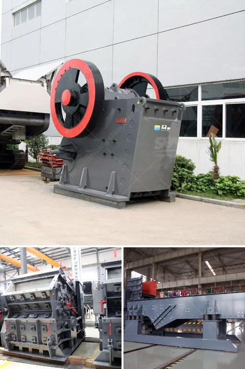

<h3>fly ash grinding machine manufacturer</h3>
Fly ash is a fine powder that is a byproduct of burning pulverized coal in electric generation power plants. Fly ash is a pozzolan, a substance containing aluminous and siliceous material that forms cement in the presence of water. When mixed with lime and water, fly ash forms a compound similar to Portland cement. This makes fly ash suitable for use as a prime material in the production of cement and concrete. 

One of the most common uses of fly ash is as an additive in concrete. It enhances the workability and durability of the concrete, making it an essential component in the construction industry. To ensure the best quality concrete, it is important to use finely ground fly ash. This is where a fly ash grinding machine manufacturer comes in.

Fly ash grinding machine refers to the grinding mill used to produce fly ash powder. Typically, the LM series vertical roller mill is used as the fly ash grinding machine. The LM series vertical roller mill is a commonly used mill for the production of fly ash powder. It has the advantages of high efficiency, energy-saving, and large-scale production capacity.

Fly ash has high application value in the market. For fly ash grinding, SBM provides customers with professional grinding equipment to ensure precision manufacturing and fine processing of fly ash powder. Through advanced technology and excellent quality, it achieves environmental protection and energy-saving production, which not only enhances the market value of fly ash, but also brings considerable profits. 

As a fly ash grinding machine manufacturer, SBM provides various types and models of grinding mills. We can also customize unique production lines according to customer's needs. The equipment is widely used in many industrial fields such as metallurgy, building materials, chemical industry, mining, and highways. The fly ash grinding machine produced by our company has high grinding efficiency, low energy consumption, and excellent environmental performance. 

In addition to fly ash grinding, we also provide customers with complete sets of production lines, such as stone crushing production line, sand making production line, and grinding production line. Our team of engineers and technicians are experienced and professional, providing technical guidance and support to customers. We always put customer needs first and strive to provide the most satisfactory service.

In conclusion, as a leading fly ash grinding machine manufacturer, SBM is committed to the development and production of environmentally friendly and energy-saving grinding equipment. We provide customers with comprehensive solutions and technical guidance to ensure that customers can obtain high-quality fly ash powder products. With advanced technology, reliable quality, and efficient services, we are dedicated to promoting the comprehensive utilization of fly ash and contributing to the development of the industry.
<h3>Contact us</h3><ul><li><strong>Whatsapp:&nbsp;<a href="https://wa.me/8613661969651">+8613661969651</a></strong></li><li><a href="https://swt.shibang-china.com/?git&amp;zhl&amp;fly ash grinding machine manufacturer"><strong>Online Service(chat now)</strong></a></li></ul><h3>Related</h3><ul><li><a href='stone paper production machine.md'>stone paper production machine</a></li><li><a href='type of stone crushers.md'>type of stone crushers</a></li><li><a href='metal crusher suppliers in sri lanka.md'>metal crusher suppliers in sri lanka</a></li><li><a href='crusher for construction price.md'>crusher for construction price</a></li><li><a href='used portable crusher plant for sale dubai.md'>used portable crusher plant for sale dubai</a></li></ul>