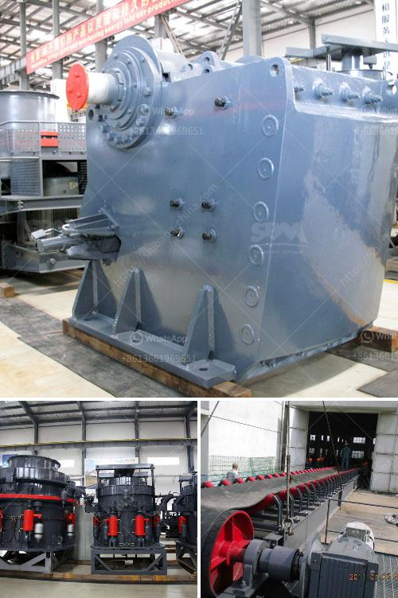

<h3>fly ash grinding</h3>
Fly ash, also known as pulverized fuel ash, is a byproduct of coal combustion that is generated in thermal power plants. This fine powder, consisting of inorganic mineral matter, is collected from the flue gases and has been increasingly recognized for its potential use in various applications. One of the most promising and profitable uses of fly ash is in the field of grinding.

Fly ash grinding refers to the process of finely grinding fly ash to improve the performance of concrete. With the ever-increasing demand for cement, producers are exploring different ways to enhance its properties and reduce costs. Incorporating fly ash into the mix has become a popular practice due to its numerous benefits.

The grinding process involves crushing and powdering fly ash to make it finer and more reactive. This increases the surface area of the fly ash particles, making them more chemically active and hence more effective in strengthening concrete. Additionally, grinding fly ash reduces its water demand, resulting in improved workability and lower water-cement ratio.

Furthermore, fly ash grinding also helps in reducing the carbon footprint of the construction industry. Utilizing fly ash as a partial replacement for cement significantly decreases the amount of clinker needed, consequently reducing CO2 emissions. This sustainable approach aligns with the industry's growing focus on eco-friendly practices and reducing environmental impacts.

To carry out fly ash grinding, specialized grinding mills are employed. These mills utilize mechanical forces such as compression, impact, and attrition to break down the fly ash particles. The resulting powder can be customized to meet specific requirements, such as fineness and reactivity, making it suitable for different construction applications.

In conclusion, fly ash grinding is a viable solution to improve the performance of concrete and reduce its environmental impact. By utilizing this byproduct of coal combustion, construction industry practices become more sustainable, while delivering superior quality products. This innovative approach not only benefits the manufacturers but also contributes to the development of a greener and more sustainable world.
<h3>Contact us</h3><ul><li><strong>Whatsapp:&nbsp;<a href="https://wa.me/8613661969651">+8613661969651</a></strong></li><li><a href="https://swt.shibang-china.com/?git&amp;zhl&amp;fly ash grinding"><strong>Online Service(chat now)</strong></a></li></ul><h3>Related</h3><ul><li><a href='bentonite pulverizer.md'>bentonite pulverizer</a></li><li><a href='vibrating screen size 1mm.md'>vibrating screen size 1mm</a></li><li><a href='stone crusher plants.md'>stone crusher plants</a></li><li><a href='stone quarry crusher in kasoa.md'>stone quarry crusher in kasoa</a></li><li><a href='stone crushing machine in kenya.md'>stone crushing machine in kenya</a></li></ul>