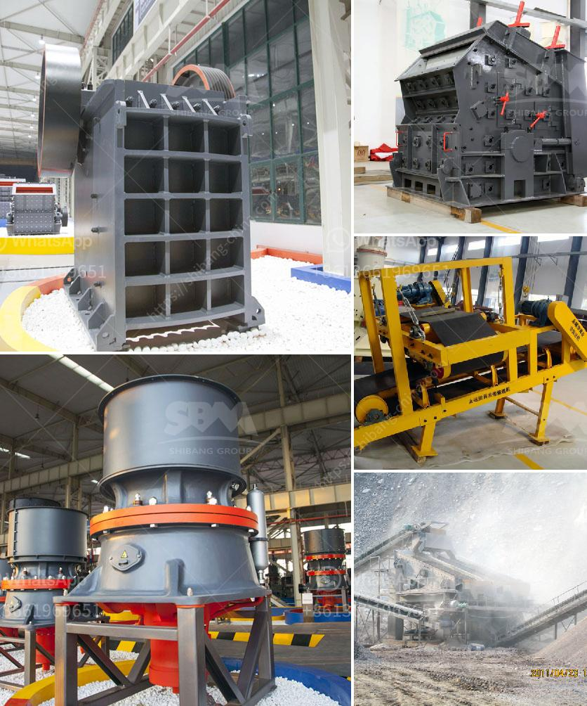

<h3>fly ash powder making</h3>
Fly ash is a residual product of burning coal in thermal power plants. Over the years, it has gained significant attention due to its various applications, particularly in construction. Fly ash powder making has become an increasingly popular process for transforming this waste material into a valuable resource.

The production of fly ash powder involves a series of steps, starting from the collection of the ash generated during coal combustion. This fly ash is then transported to a processing plant, where it undergoes several treatments to convert it into a fine powder.

One of the main advantages of fly ash powder making is its positive impact on the environment. By utilizing this waste material, we reduce the need for landfill disposal, which in turn helps in reducing air and water pollution. Additionally, the production of fly ash powder requires less energy compared to the production of cement, thus significantly reducing carbon emissions.

The benefits of using fly ash powder in construction are vast. Firstly, fly ash acts as a supplementary cementitious material, increasing the strength and durability of concrete. It fills voids between cement particles, enhancing the overall microstructure of the concrete. Moreover, the use of fly ash powder results in lower heat of hydration, reducing the risk of thermal cracking.

Another advantage of fly ash powder is its ability to enhance the workability of concrete. Due to its fine particle size and spherical shape, fly ash powder improves the flowability of concrete, making it easier to pour and finish. This, in turn, reduces the need for excessive water, leading to a denser and more impermeable concrete structure.

Additionally, fly ash powder is a cost-effective alternative to cement. As a byproduct of coal combustion, it is readily available at a lower cost than cement. This makes it an attractive choice for construction projects, especially those with a limited budget. Moreover, the use of fly ash powder in concrete leads to long-term cost savings through reduced maintenance and repairs.

In recent years, fly ash powder has found applications beyond concrete production. It is now being used in the manufacturing of bricks, ceramics, and even in soil stabilization. The high silica and alumina content in fly ash make it an ideal raw material for these industries, as it enhances the strength and durability of the final products.

However, it is important to note that the quality of fly ash powder depends on various factors, including the composition of the fly ash, processing techniques, and adherence to quality standards. Therefore, it is crucial to ensure that the fly ash powder being used meets the required specifications to achieve the desired benefits.

In conclusion, fly ash powder making is revolutionizing waste management in the coal industry. By transforming this waste material into a valuable resource, we are not only reducing the burden on landfills but also creating a sustainable solution for construction and other industries. With its numerous environmental and economic benefits, fly ash powder is increasingly becoming a preferred choice in the construction sector, paving the way for a greener and more sustainable future.
<h3>Contact us</h3><ul><li><strong>Whatsapp:&nbsp;<a href="https://wa.me/8613661969651">+8613661969651</a></strong></li><li><a href="https://swt.shibang-china.com/?git&amp;zhl&amp;fly ash powder making"><strong>Online Service(chat now)</strong></a></li></ul><h3>Related</h3><ul><li><a href='vibrating screen size decision.md'>vibrating screen size decision</a></li><li><a href='products pe jaw crusher.md'>products pe jaw crusher</a></li><li><a href='benefits of vsi crusher.md'>benefits of vsi crusher</a></li><li><a href='gypsum powder production process.md'>gypsum powder production process</a></li><li><a href='impact crusher for sale in saudi arabia.md'>impact crusher for sale in saudi arabia</a></li></ul>