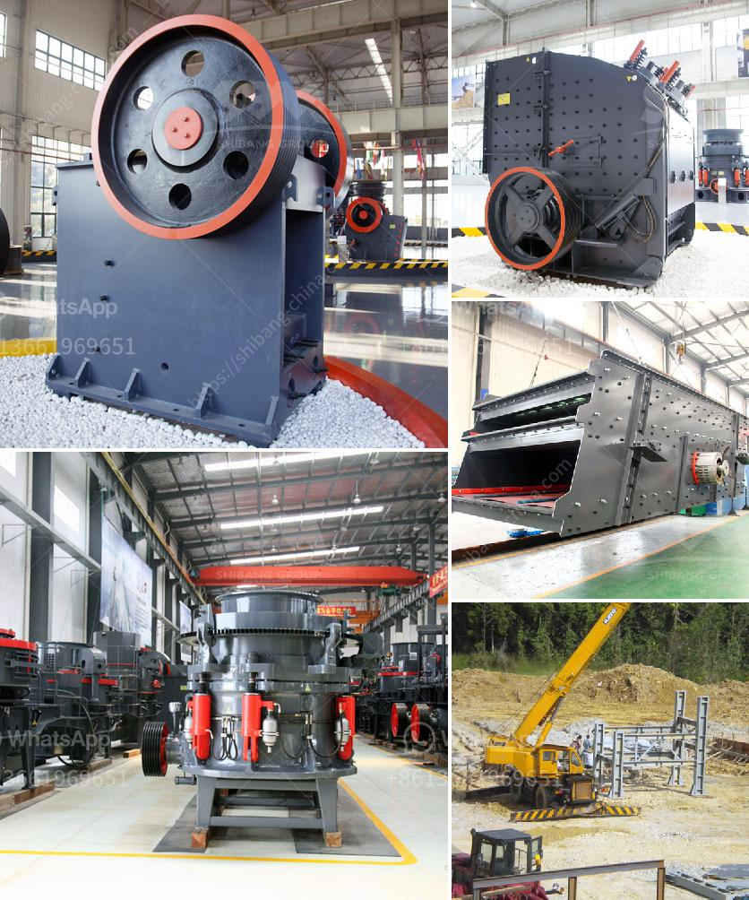

<h3>formula for belt conveyor tonne per hour</h3>
A belt conveyor is a mechanical device used to transport bulk materials from one place to another. They are commonly used in many industries including mining, manufacturing, and airports for efficient and safe transportation of goods. The capacity of a belt conveyor is determined by several factors, including the speed, width, and angle of the belt, as well as the characteristics of the material being conveyed.

One of the most important aspects of designing a belt conveyor system is determining the tonnage per hour (TPH) capacity that the system needs to transport. This requirement is crucial for ensuring that the conveyor can handle the desired amount of material without causing any bottleneck or excessive strain on the components.

The formula for calculating the TPH capacity of a belt conveyor system is fairly simple and straightforward. The formula is:

For example, let's assume that we have a belt conveyor system with a belt speed of 100 FPM and a width of 36 inches. Using the formula above, we can calculate the TPH capacity:

To convert this value to tons per hour, we simply multiply the result by 60 since there are 60 minutes in an hour:

It is important to note that the formula above is a general guideline and may not accurately represent the actual capacity of every belt conveyor system. There are other factors to consider, such as the type and size of the material being transported, the inclination angle of the conveyor, and any additional load or resistances that the system may encounter. These factors need to be taken into account when designing a belt conveyor system to ensure optimal performance and efficiency.

This formula provides a basic guideline for determining the capacity of a belt conveyor system. However, it is important to consider additional factors and variables to accurately estimate the actual capacity of the system. Professional advice and expertise should be sought when designing and calculating the capacity of a belt conveyor system to ensure optimal performance and safety.
<h3>Contact us</h3><ul><li><strong>Whatsapp:&nbsp;<a href="https://wa.me/8613661969651">+8613661969651</a></strong></li><li><a href="https://swt.shibang-china.com/?git&amp;zhl&amp;formula for belt conveyor tonne per hour"><strong>Online Service(chat now)</strong></a></li></ul><h3>Related</h3><ul><li><a href='stone crusher supplier.md'>stone crusher supplier</a></li><li><a href='stone crusher from china.md'>stone crusher from china</a></li><li><a href='spare parts cone crushers telesmit cone.md'>spare parts cone crushers telesmit cone</a></li><li><a href='manufacturer of coal processing equipment.md'>manufacturer of coal processing equipment</a></li><li><a href='rotary kilns in indonesia.md'>rotary kilns in indonesia</a></li></ul>