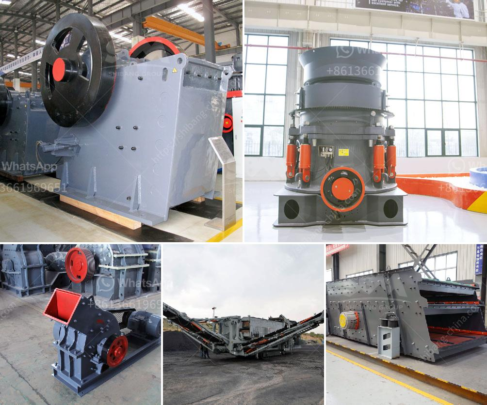

<h3>free technical drawings ore hammer mill</h3>
The hammer mill is a critical component of most feed manufacturing operations. Its main purpose is to grind grains into smaller particles that can be used to feed livestock or create other food products.

Hammer mills are known for their ability to produce a wide range of particle sizes. They are capable of grinding materials with a diameter of less than 1mm to particles as small as 50 microns. This versatility makes them suitable for a variety of industries, including pharmaceutical and chemical manufacturing, as well as animal feed production.

As with any piece of equipment, proper maintenance is crucial to ensuring the longevity and efficiency of a hammer mill. Regular inspection and routine maintenance can significantly reduce the risk of unexpected breakdowns, downtime, and costly repairs. However, technical drawings can be instrumental in facilitating this process.

Technical drawings are detailed illustrations that provide a comprehensive view of the hammer mill's components and layout. They serve as a visual guide for technicians and engineers, enabling them to easily identify and understand the various parts of the machine. This information is invaluable when it comes to troubleshooting and performing maintenance tasks.

One of the key advantages of technical drawings for hammer mills is that they are usually provided free of charge by the manufacturer. This accessibility allows operators to access the necessary information without incurring additional costs, making it easier to perform routine maintenance and extend the lifespan of the machine.

Additionally, technical drawings help to ensure consistency across different models and brands of hammer mills. They provide a standardized representation of the equipment, making it easier for technicians to familiarize themselves with the machine's components, regardless of the specific model they are working on.

Moreover, technical drawings are not limited to just identifying parts and components. They also provide valuable information about the proper assembly and disassembly of the hammer mill. This knowledge is essential for technicians when it comes to replacing worn out parts or conducting repairs.

In conclusion, the availability of free technical drawings for hammer mills is a significant advantage for operators in the feed manufacturing industry. These drawings play a crucial role in facilitating proper maintenance and maximizing the performance of the machine. They provide an invaluable visual guide that enables technicians to easily identify and understand the various parts of the hammer mill, ensuring its longevity and efficiency. By harnessing the power of technical drawings, operators can reduce the risk of unexpected breakdowns, minimize downtime, and optimize their productivity.
<h3>Contact us</h3><ul><li><strong>Whatsapp:&nbsp;<a href="https://wa.me/8613661969651">+8613661969651</a></strong></li><li><a href="https://swt.shibang-china.com/?git&amp;zhl&amp;free technical drawings ore hammer mill"><strong>Online Service(chat now)</strong></a></li></ul><h3>Related</h3><ul><li><a href='smallest cement plant.md'>smallest cement plant</a></li><li><a href='crushing machine manufacturers china.md'>crushing machine manufacturers china</a></li><li><a href='river sand mining machine for sale.md'>river sand mining machine for sale</a></li><li><a href='copper mining in zambia.md'>copper mining in zambia</a></li><li><a href='price conveyor belt price.md'>price conveyor belt price</a></li></ul>