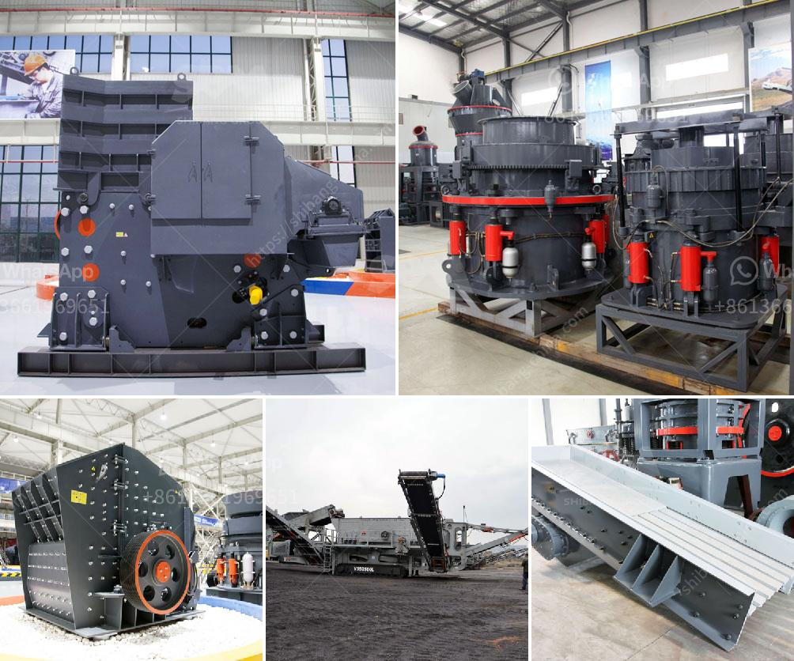

<h3>from lead ore saparated gold and silver plant</h3>
In the realm of mining and ore processing, plants play a crucial role in extracting valuable minerals from raw materials. One such plant, adept at separating gold and silver from lead ore, takes center stage in this fascinating process.

Lead ore, a rock composed primarily of lead minerals, often comes with additional impurities, including gold and silver. Extracting these precious metals requires a systematic approach, enabling the maximum yield while minimizing losses. The plant undertaking this task is a testament to human ingenuity and technological advancements.

The journey begins with the arrival of lead ore at the plant. Once it reaches the processing facility, it is regularly sampled to analyze its composition. This data is vital, as it determines the subsequent steps in the separation process.

The first step involves crushing the lead ore into smaller pieces. Large crushers break down the ore, allowing for easier handling and extraction of the valuable minerals. The ore is then ground into a fine powder, enhancing the effectiveness of the separation process.

Next, the powdered lead ore undergoes a flotation process. This technique utilizes chemicals to make the lead minerals float while the impurities sink. Frothers and collectors are added to the mix, enhancing the flotation process. This crucial step ensures the maximum recovery of lead minerals and creates a concentrate rich in lead.

After the flotation process, the concentrate is subjected to further refining. This step aims to separate the lead concentrate from other impurities, such as gold and silver. A series of chemical treatments, including smelting and refining, are employed to achieve this separation.

In smelting, the lead concentrate is heated in a furnace to a high temperature. This causes the metals to melt and separate based on their differing melting points. The molten metal containing lead is then collected, while the impurities remain behind.

Refining the collected lead is the next vital step. In this stage, the lead undergoes a purification process, removing any lingering impurities. The resulting purified lead is now ready for market use.

But what about gold and silver? Along with the lead, these valuable metals have remained trapped in the impurities. The plant dedicates an additional process to liberate these precious metals.

The remaining impurities, containing gold and silver, are subjected to leaching. Leaching involves the use of chemicals to extract metals from solid materials by dissolving them into a liquid. For this purpose, a cyanide solution is commonly employed. The impurity mixture is treated with the cyanide solution, allowing gold and silver to dissolve into the liquid.

Finally, the gold and silver are recovered from the liquid through a precipitation process. Special chemicals are added to the liquid, causing the metals to solidify as particles. These particles are then separated from the liquid, dried, and further refined to achieve market-ready gold and silver.

In conclusion, the journey from lead ore to separating gold and silver showcases the intricate and meticulous steps involved in mineral extraction. With the aid of advanced technology, the plant makes the best use of lead ore, ensuring maximum recovery of valuable metals. From crushing and grinding to flotation, smelting, and refining, each step in the process plays a vital role in obtaining lead and separating gold and silver.
<h3>Contact us</h3><ul><li><strong>Whatsapp:&nbsp;<a href="https://wa.me/8613661969651">+8613661969651</a></strong></li><li><a href="https://swt.shibang-china.com/?git&amp;zhl&amp;from lead ore saparated gold and silver plant"><strong>Online Service(chat now)</strong></a></li></ul><h3>Related</h3><ul><li><a href='lime stone crusher section in cement plant pdf.md'>lime stone crusher section in cement plant pdf</a></li><li><a href='vibrating screen size decision.md'>vibrating screen size decision</a></li><li><a href='gypsum production in visakhapatnam.md'>gypsum production in visakhapatnam</a></li><li><a href='gold wash plant manufacturer in india.md'>gold wash plant manufacturer in india</a></li><li><a href='nigeria vertical mill machine.md'>nigeria vertical mill machine</a></li></ul>