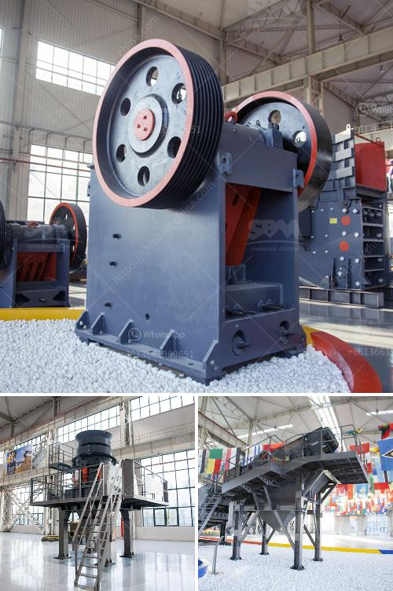

<h3>fuel rate for rock crushers</h3>
Fuel efficiency and electric power Traditionally, mobile rock crushers have been used as oversized stone crushers. However, recent advancements have enabled them to improve fuel efficiency and reduce operational costs. This is essential for businesses operating in the mining and construction industries, where fuel can make up a significant portion of the operating expenses.

One crucial factor to consider when choosing a rock crusher is its fuel consumption rate. In this article, we will explore the various aspects of fuel consumption in rock crushers that range from 300 to 500 tons per hour (TPH).

In recent years, there has been a growing demand for energy-efficient machinery – and the rock crusher industry is no exception. With the introduction of diesel-electric hybrid systems, it is now possible for mobile crushers to offer excellent fuel efficiency. These systems combine electric motors with diesel engines, allowing the crushers to work in both diesel and electric modes.

When operating on diesel power, the consumption rate depends on several variables, including the type and size of the rock crusher, the size and hardness of the feed material, the fleet management system, and the level of maintenance. On average, a rock crusher consumes about 10 liters of fuel per hour in a typical application.

However, the introduction of electric power options has transformed the fuel consumption landscape. Electric-powered rock crushers can operate on electric power alone and can work for up to 20 hours without needing to refuel.

The benefits of electricity in terms of fuel efficiency are substantial. Firstly, electricity is a more cost-effective energy source than diesel. With lower prices and the ability to harness renewable energy, such as solar or wind power, operating costs can be significantly reduced.

Secondly, electric power provides enhanced reliability. Unlike diesel engines, which require maintenance, refueling, and potential downtime, electric motors are more reliable and require less maintenance. This results in increased uptime, streamlined operations, and reduced costs.

Moreover, when operating in electric mode, the rock crusher produces zero emissions, making it a more sustainable and environmentally friendly option.

For businesses that require high-capacity crushers, models with advanced efficiency features are available. These crushers can achieve a fuel rate as low as 4 liters per hour, delivering substantial cost savings. However, it is important to note that the actual fuel consumption rate may vary based on the specific application and operating conditions.

In conclusion, fuel consumption is a significant aspect to consider when selecting a rock crusher for your business. With advancements in technology, it is now possible to choose electric-powered crushers that not only offer excellent fuel efficiency but also reduce operational costs and contribute to a more sustainable future. By selecting the right crusher and optimizing its usage, businesses can achieve significant fuel savings, improve profitability, and minimize their environmental impact.
<h3>Contact us</h3><ul><li><strong>Whatsapp:&nbsp;<a href="https://wa.me/8613661969651">+8613661969651</a></strong></li><li><a href="https://swt.shibang-china.com/?git&amp;zhl&amp;fuel rate for rock crushers"><strong>Online Service(chat now)</strong></a></li></ul><h3>Related</h3><ul><li><a href='process of crushing granite.md'>process of crushing granite</a></li><li><a href='secondary cone crusher.md'>secondary cone crusher</a></li><li><a href='quarry plant for sale south africa.md'>quarry plant for sale south africa</a></li><li><a href='ball mills for sale.md'>ball mills for sale</a></li><li><a href='portable aggregate crushing plants.md'>portable aggregate crushing plants</a></li></ul>