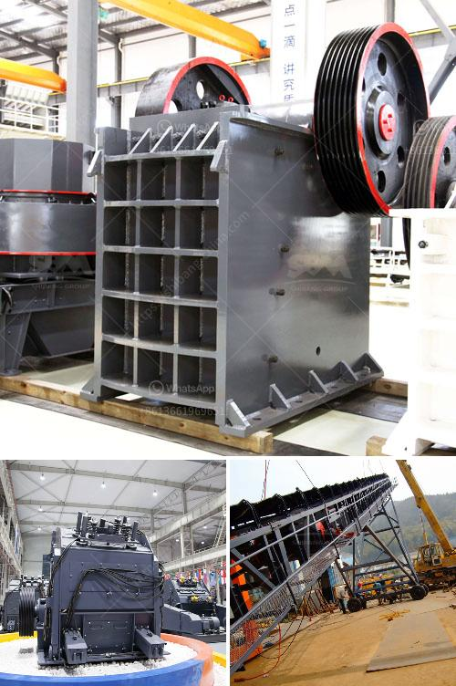

<h3>full quarry machines for sale in china</h3>
If you are in the construction or mining business, then one of your top priorities must be finding the best quality quarry machines for sale in China. As the world’s largest economy, China continues to dominate in global manufacturing and production, exporting a wide array of products to different countries every day. When it comes to quarry machines, China has the advantage of being home to numerous manufacturers and suppliers offering a vast range of options.

China has been investing heavily in improving its infrastructure, leading to a surge in demand for construction materials. This has resulted in an increased need for quarry machines that can efficiently extract stone, minerals, and other useful resources from the ground. Whether you are looking for a full quarry machine setup or individual machines to add to your existing collection, China offers a wide selection to choose from.

Firstly, consider what type of quarry machine you need, as there are different variants available. Some common types include crushers, vibrating screens, conveyor belts, loaders, and excavators. Each machine serves a specific purpose in the quarrying process, so it’s crucial to identify your requirements before making a purchase. Once you have a clear understanding of your needs, you can begin exploring the Chinese market for the best options.

China is home to many advanced and reliable manufacturing companies specializing in quarry machines. These manufacturers offer a range of state-of-the-art machines equipped with the latest technologies to enhance efficiency and productivity. With a wide pool of options available, you will be able to find a machine that perfectly matches your requirements.

Since China is a global manufacturing hub, you can find quarry machines for sale in different price ranges. From cost-effective machines suitable for small-scale operations to high-end, heavy-duty machines for large-scale operations, China caters to every budget. This allows you to find a machine that offers the best value for your investment.

When purchasing quarry machines from China, it is essential to research and select reliable suppliers. Look for companies with a good reputation, positive customer reviews, and a proven track record in delivering high-quality machines. Consultation with industry experts or professionals can also provide valuable insights and recommendations.

Moreover, buying quarry machines from China also offers the flexibility of customization. You may find suppliers who offer tailored solutions to meet your specific needs. This customization can include modifications to machine size, capacity, power, and even design. By working closely with a trusted manufacturer, you can acquire a quarry machine that is perfectly adapted to your operational requirements.

With its extensive range of quarry machines for sale, combined with its manufacturing expertise and advanced technologies, China continues to be a leading supplier in this sector. Whether you are looking to establish a new quarry or upgrade your existing machinery, China offers a plethora of options to choose from. Make sure to conduct thorough research, engage with reputable suppliers, and consider customization possibilities to ensure you acquire the best quarry machines that cater to your business needs.
<h3>Contact us</h3><ul><li><strong>Whatsapp:&nbsp;<a href="https://wa.me/8613661969651">+8613661969651</a></strong></li><li><a href="https://swt.shibang-china.com/?git&amp;zhl&amp;full quarry machines for sale in china"><strong>Online Service(chat now)</strong></a></li></ul><h3>Related</h3><ul><li><a href='cost of setting up a quarry crusher plant.md'>cost of setting up a quarry crusher plant</a></li><li><a href='financial statements of miningpanies.md'>financial statements of miningpanies</a></li><li><a href='slag powder grinding in india.md'>slag powder grinding in india</a></li><li><a href='iron ore washing plant.md'>iron ore washing plant</a></li><li><a href='lime stone crusher section in cement plant pdf.md'>lime stone crusher section in cement plant pdf</a></li></ul>