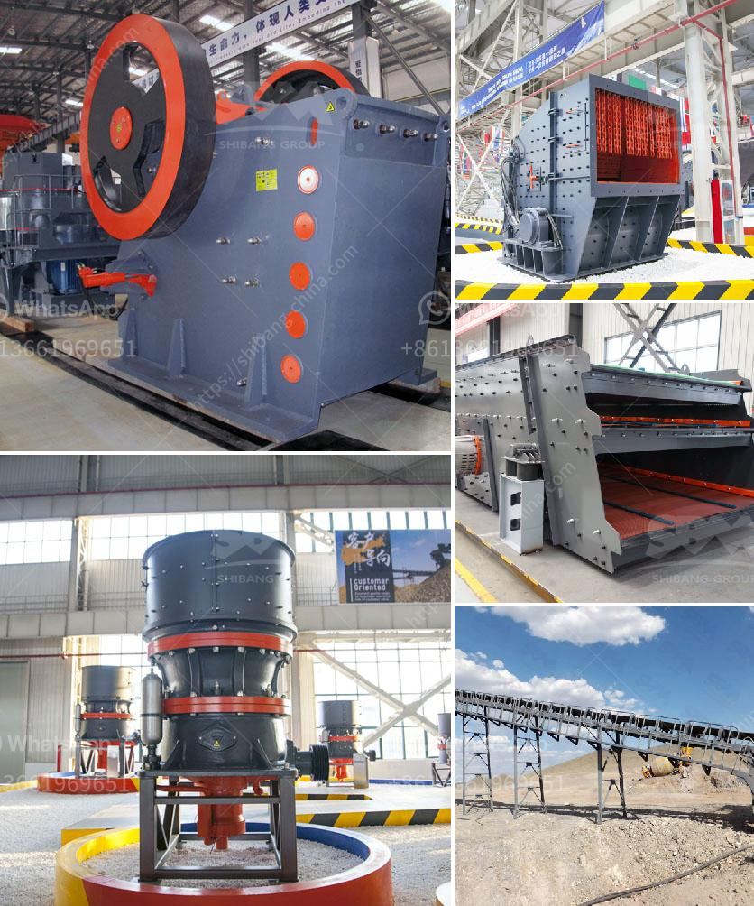

<h3>germany made grinding mill</h3>
Germany is renowned for its technological advancements in various industrial sectors. As such, it comes as no surprise that Germany-made grinding mills are widely used in the manufacturing sector today. With its reputation for quality and efficiency, a Germany-made grinding mill offers durability and performance that is unrivaled in the market.

One of the key factors that contribute to the success of Germany-made grinding mills is the rigorous testing and quality control measures which are implemented during the manufacturing process. German engineers are known for their attention to detail and precision, and these qualities are reflected in the grinding mill's design and construction. Each component is carefully crafted to ensure optimal performance and longevity.

Furthermore, Germany-made grinding mills are known for their use of cutting-edge technology. German manufacturers constantly strive to innovate and improve their products, and grinding mills are no exception. Advanced features such as automatic feeding systems, temperature control mechanisms, and safety measures are integrated into the grinding mills to enhance their functionality and efficiency. This ensures that the end-user can achieve the desired results with minimal effort and maximum precision.

An important aspect that sets Germany-made grinding mills apart from their competitors is their versatility. These grinding mills are designed to handle a wide range of materials and grinding applications, including but not limited to minerals, chemicals, pharmaceuticals, and food processing. This versatility allows manufacturers in various industries to rely on a single grinding mill for multiple purposes, rather than investing in multiple specialized machines.

In addition to their quality and versatility, Germany-made grinding mills are also known for their energy efficiency. German engineering principles prioritize energy conservation and sustainability. As a result, grinding mills manufactured in Germany are designed to consume minimal energy while delivering maximum output. This not only helps manufacturers reduce their environmental impact but also significantly lowers operational costs in the long run.

The reputation of Germany-made grinding mills extends beyond the borders of the country. Their quality and efficiency have gained global recognition, making them a sought-after choice for manufacturers worldwide. From large-scale production facilities to small businesses, German grinding mills have become a symbol of reliability and precision.

In conclusion, Germany-made grinding mills exemplify the country's dedication to superior quality, efficiency, and innovation. With cutting-edge technology, versatile applications, and energy efficiency, these grinding mills offer a superior solution for a diverse range of industrial grinding needs. Manufacturers worldwide can rely on Germany-made grinding mills to optimize their production processes and achieve exceptional results. It is no wonder that Germany remains at the forefront of the global grinding mill industry.
<h3>Contact us</h3><ul><li><strong>Whatsapp:&nbsp;<a href="https://wa.me/8613661969651">+8613661969651</a></strong></li><li><a href="https://swt.shibang-china.com/?git&amp;zhl&amp;germany made grinding mill"><strong>Online Service(chat now)</strong></a></li></ul><h3>Related</h3><ul><li><a href='small ball grinding machine.md'>small ball grinding machine</a></li><li><a href='vsi crusher for 100tph output per hour.md'>vsi crusher for 100tph output per hour</a></li><li><a href='grinding machine manufacturers ethiopia.md'>grinding machine manufacturers ethiopia</a></li><li><a href='mtw trapezium mill.md'>mtw trapezium mill</a></li><li><a href='gravel crusher supplier in the philippines.md'>gravel crusher supplier in the philippines</a></li></ul>