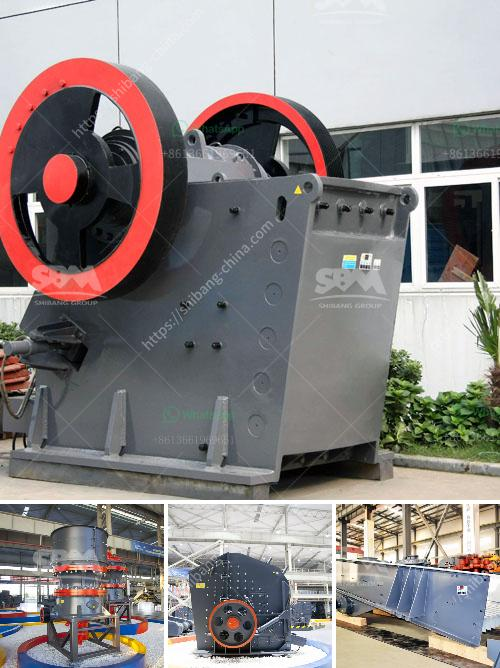

<h3>gold crusher in south africa</h3>
South Africa is known for its abundant mineral resources, including gold, diamonds, and various precious metals. Today, the country remains one of the world's leading gold producers, exporting over 100 tons of gold every year. With its rich mining history and complex geology, gold mining in South Africa is a significant industry and plays a crucial role in the country's economy.

One of the essential machines for gold mining operations is the gold crusher. More than the raw material extraction process, these machines play a crucial role in the entire gold mining chain. The primary purpose of this equipment is to break large rocks into smaller pieces, making it easier for miners to extract the precious metal hidden within.

The process begins with digging gold ore from the ground. Once the ore is extracted, it is transported to a crusher where it is broken down into smaller fragments. The gold crusher utilizes force, pressure, and impact to pulverize the rocks into smaller particles. This step is critical because it enhances the extraction efficiency of the gold by making it easier to separate the valuable metal from the surrounding rock.

Gold crushers in South Africa come in various forms and sizes, from large jaw crushers to small cone crushers. These machines help miners process and extract the gold, increasing productivity and reducing the risk of accidents. Some common features of a gold crusher include:

1. Capacity: Gold crushers come in different sizes to handle varying loads and production requirements. The capacity of the crusher determines the amount of gold ore that can be processed in a given time.

2. Power source: Gold crushers can operate on electricity, diesel, or portable generators depending on the availability of power in the mining area.

3. Crushing mechanism: The crushers may have a fixed or movable jaw to accomplish the crushing action. Some machines use compression forces to crush the rocks, while others rely on impact or shear forces.

4. Efficiency and maintenance: Gold crushers should be designed for easy maintenance to ensure continuous operation and prevent downtime. The machines must also provide high crushing efficiency to maximize the yield of gold extraction.

The use of gold crushers is not limited to South Africa but is a well-adopted technique globally. The machines are widely used in gold mining operations in other gold-rich regions such as Australia, Canada, and the United States.

Gold mining in South Africa has faced numerous challenges over the years, including labor unrest, rising operational costs, and decreasing gold reserves. However, with solid infrastructure and continuous technological advancements, the industry remains resilient and continues to thrive. The gold crusher is just one of the many pieces of machinery that plays a crucial role in the success of gold mining in South Africa.

In conclusion, gold crushers in South Africa are essential for enhancing gold extraction efficiency, breaking down large rocks to extract the valuable metal within. They come in different sizes and types, providing various crushing mechanisms to suit the specific needs of gold mining operations. Despite the challenges faced by the industry, gold mining in South Africa continues to contribute significantly to the country's economy and remains a vital aspect of its mining heritage.
<h3>Contact us</h3><ul><li><strong>Whatsapp:&nbsp;<a href="https://wa.me/8613661969651">+8613661969651</a></strong></li><li><a href="https://swt.shibang-china.com/?git&amp;zhl&amp;gold crusher in south africa"><strong>Online Service(chat now)</strong></a></li></ul><h3>Related</h3><ul><li><a href='manganese ore concentrate south africa.md'>manganese ore concentrate south africa</a></li><li><a href='limestone quarry mining plant price.md'>limestone quarry mining plant price</a></li><li><a href='gold mining price.md'>gold mining price</a></li><li><a href='stone crusher machine crusher.md'>stone crusher machine crusher</a></li><li><a href='ball milling machines suppliers in egypt.md'>ball milling machines suppliers in egypt</a></li></ul>