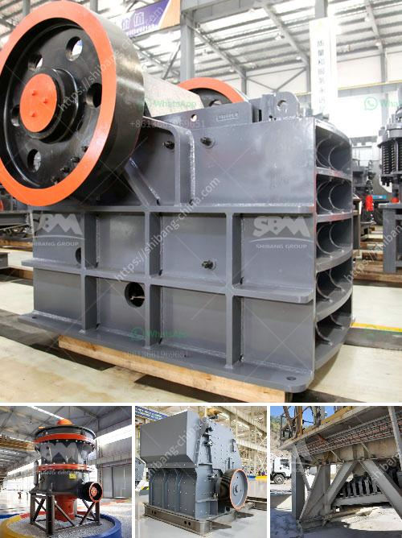

<h3>gold crushers sale</h3>
Gold is considered one of the most valuable and sought-after precious metals in the world. With its timeless allure and ability to retain its value even during economic downturns, gold remains a sound investment option. However, the process of extracting gold from the earth can be challenging and costly. That is where the gold crushers come into play.

Gold crushers are specialized equipment designed to break down large chunks of rock into smaller, more manageable pieces, allowing for more efficient extraction of gold. These crushers use mechanical force to grind and crush the ore, reducing it to a specific size before refining and extracting the valuable metal. The crushed ore is then processed using various techniques to separate the gold from other minerals and impurities.

One of the significant advantages of gold crushers is their versatility and ability to handle different types of ores. Whether it is placer deposits or hard rock gold, these crushers have the power and capacity to break down the ore for further processing. Moreover, they can operate in various environments, including mines, quarries, or even on remote exploration sites.

The market for gold crushers has witnessed a surge in recent years due to the increasing demand for gold and the rising prices of the precious metal. As more investors turn to gold as a safe haven for their wealth, the need for efficient and reliable equipment for gold mining and extraction becomes even more critical.

Furthermore, technological advancements in the field of gold crushers have made them more reliable, efficient, and cost-effective. Modern crushers offer higher production rates, reduced downtime, and improved overall performance. They are equipped with innovative features such as adjustable settings, automated controls, and more durable components, ensuring optimal operation and longevity.

For those looking to invest in gold mining, acquiring a gold crusher can be a lucrative decision. By crushing large quantities of gold-bearing ore, miners can maximize their chances of extracting a higher volume of gold. This, in turn, directly impacts the profitability of the mining operation.

In conclusion, gold crushers are a vital component of the gold mining industry. They enable efficient and cost-effective extraction of gold from ore, ensuring maximum returns for investors and miners alike. As the demand for gold continues to rise, so does the need for reliable and advanced gold crushers. By investing in these essential pieces of equipment, individuals and businesses can unlock the potential of precious metals and secure their financial futures in an increasingly uncertain world.
<h3>Contact us</h3><ul><li><strong>Whatsapp:&nbsp;<a href="https://wa.me/8613661969651">+8613661969651</a></strong></li><li><a href="https://swt.shibang-china.com/?git&amp;zhl&amp;gold crushers sale"><strong>Online Service(chat now)</strong></a></li></ul><h3>Related</h3><ul><li><a href='mobile stone crusher machine price.md'>mobile stone crusher machine price</a></li><li><a href='how much do rock crushers cost.md'>how much do rock crushers cost</a></li><li><a href='china gold water grinding mills.md'>china gold water grinding mills</a></li><li><a href='gypsum powder machine for sale.md'>gypsum powder machine for sale</a></li><li><a href='small ball mill price.md'>small ball mill price</a></li></ul>