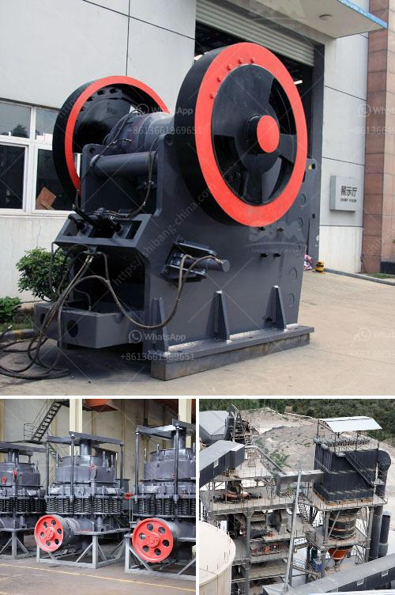

<h3>gold milling licence in zimbabwe</h3>
The gold milling licence in Zimbabwe is one of the crucial permits for operating a gold processing plant. The purpose of this licence is to regulate the exploitation and milling of gold deposits in the country. Any individual or company interested in mining and processing gold must first acquire this licence from the Ministry of Mines and Mining Development.

Obtaining a gold milling licence involves fulfilling certain requirements set by the government. These requirements typically include submitting an application form, providing proof of financial capacity to conduct mining operations, and demonstrating expertise in gold processing techniques. Additionally, applicants must comply with environmental regulations and demonstrate a commitment to responsible mining practices.

Once the licence is granted, the holder has the right to establish and operate a gold milling plant. This includes the extraction, processing, and sale of gold. The licence serves as a permit to legally exploit the gold deposits within a specified area, providing a legal framework for such operations.

The gold milling licence in Zimbabwe is crucial for both small-scale miners and large-scale mining companies. It ensures that miners operate within the confines of the law, reducing the risk of illegal mining activities. By regulating the industry, the government can ensure that gold mining operations are conducted sustainably and in line with international best practices.

Due to the significance of the gold mining industry for Zimbabwe's economy, the government is committed to supporting and promoting responsible mining practices. The gold milling licence plays a critical role in achieving this goal by creating a legal framework for gold processing operations.

In conclusion, the gold milling licence in Zimbabwe is a vital permit for any individual or company interested in mining and processing gold. It provides a legal framework for conducting gold mining operations while ensuring compliance with environmental regulations and responsible mining practices. By obtaining this licence, miners can operate within the confines of the law, contributing to Zimbabwe's economy and promoting sustainable mining practices.
<h3>Contact us</h3><ul><li><strong>Whatsapp:&nbsp;<a href="https://wa.me/8613661969651">+8613661969651</a></strong></li><li><a href="https://swt.shibang-china.com/?git&amp;zhl&amp;gold milling licence in zimbabwe"><strong>Online Service(chat now)</strong></a></li></ul><h3>Related</h3><ul><li><a href='pebble crusher for sale.md'>pebble crusher for sale</a></li><li><a href='used stone cutting machine from japan.md'>used stone cutting machine from japan</a></li><li><a href='material of sectional conveyor belts.md'>material of sectional conveyor belts</a></li><li><a href='gold wash plant for sale uk.md'>gold wash plant for sale uk</a></li><li><a href='difference between milling and grinding.md'>difference between milling and grinding</a></li></ul>