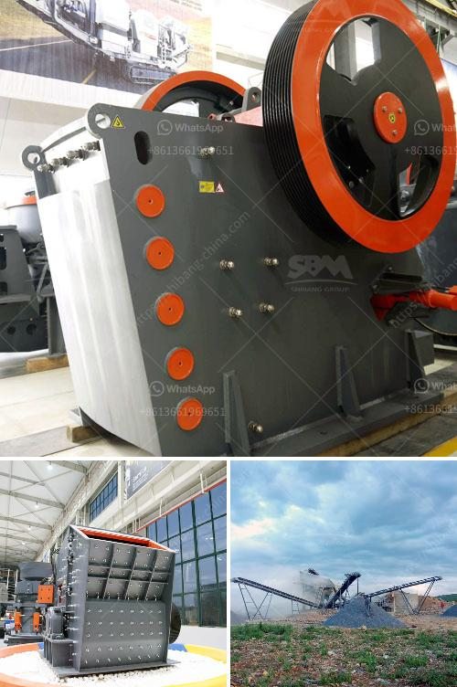

<h3>gold mining equipment manufacturers</h3>
Gold mining refers to the extraction of gold from the ground. Gold is a precious metal that has been used for centuries in various industries, including jewelry, electronics, medicine, and finance. The demand for gold continues to rise, making it a lucrative industry for investors and miners alike. To extract gold successfully, miners rely on specialized equipment manufactured by reputable companies that understand the requirements of the task.

Gold mining equipment manufacturers play a crucial role in the mining industry. The equipment they manufacture not only enhances the overall productivity and efficiency of gold mining operations but also reduces the environmental impact of the process. Over the years, advancements in technology have allowed manufacturers to develop innovative equipment for various stages of gold extraction.

One such equipment commonly used in gold mining is the trommel. A trommel is a cylindrical drum-like machine that is used for washing and separating placer gold from other materials. It consists of a rotating drum with various sizes of screens that allow smaller-sized materials to pass through while retaining larger-sized materials. Gold mining equipment manufacturers design trommels with different configurations to cater to the specific needs of miners. They are widely used due to their high processing capacity, ease of operation, and low cost.

Another essential piece of equipment in gold mining is the sluice box. A sluice box is a trough-like device that uses the principle of gravity to separate gold from other sediments. As water flows through the sluice box, gold particles are trapped on the riffles or grass matting, while the lighter sediments are swept away. Gold mining equipment manufacturers continuously innovate and improve sluice boxes to enhance gold recovery rates and minimize gold losses.

Gold mining also requires the use of crushers and mills. Crushers are machines designed to break large rocks into smaller, more manageable sizes. They are used to reduce the size of gold-bearing ore before it is further processed. Manufacturers of gold mining equipment produce crushers that are durable, efficient, and capable of handling various types of rocks and ores.

Mills, on the other hand, are used to grind gold-bearing ore into fine particles. They can be either ball mills, which rotate around a horizontal axis, or stamp mills, which pound the ore with heavy iron stamps. Gold mining equipment manufacturers ensure that mills are designed and constructed with high-quality materials and advanced technology to optimize gold extraction.

Lastly, metal detectors are indispensable tools for gold miners. They are used to detect the presence of gold in rock formations underground. Modern metal detectors are equipped with advanced features like target identification and depth indication. Gold mining equipment manufacturers produce metal detectors with high sensitivity to accurately detect even the smallest amounts of gold, improving efficiency and reducing manual labor.

In conclusion, gold mining equipment manufacturers play a critical role in the success of gold mining operations. Their specialized equipment enhances the efficiency and productivity of the extraction process while minimizing environmental impact. With advancements in technology, manufacturers continue to innovate and develop new equipment that caters to the evolving needs of gold miners. As the demand for gold continues to rise, the importance of reliable and efficient equipment from reputable manufacturers cannot be underestimated in the gold mining industry.
<h3>Contact us</h3><ul><li><strong>Whatsapp:&nbsp;<a href="https://wa.me/8613661969651">+8613661969651</a></strong></li><li><a href="https://swt.shibang-china.com/?git&amp;zhl&amp;gold mining equipment manufacturers"><strong>Online Service(chat now)</strong></a></li></ul><h3>Related</h3><ul><li><a href='beneficiation small scale tin ore processing plant.md'>beneficiation small scale tin ore processing plant</a></li><li><a href='chromite ore processing in zimbabwe.md'>chromite ore processing in zimbabwe</a></li><li><a href='desain gambar vibrating screen 100ton jam.md'>desain gambar vibrating screen 100ton jam</a></li><li><a href='serie dgs utiliza en piedra linea de produccion.md'>serie dgs utiliza en piedra linea de produccion</a></li><li><a href='rock crusher screen.md'>rock crusher screen</a></li></ul>