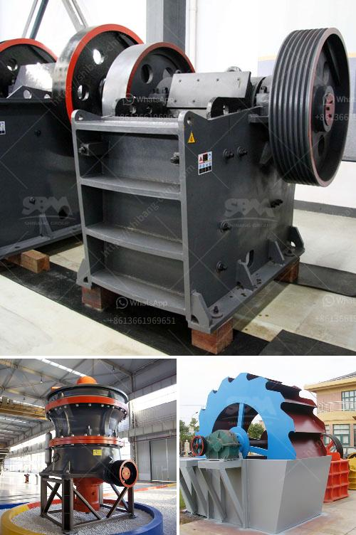

<h3>gold mining machinery</h3>
Gold mining has been a major industry around the world for centuries, but the technological advancements and innovations achieved in recent years have made this industry even more efficient. One of the key factors contributing to this efficiency is the use of advanced gold mining machinery.

Gold mining machinery plays a crucial role in the mining process. These machines belong to a category of heavy machinery, which includes bulldozers, backhoes, excavators, loaders, and trucks. Today's gold mining machines are much more efficient and complex, incorporating advanced technologies and features that increase productivity while minimizing environmental impacts.

One of the most commonly used machines in gold mining is the excavator. An excavator is a large vehicle with a bucket attached to a hydraulic arm. Excavators are used to remove the overburden, which is the layer of soil and rock covering the gold deposits. The excavator's bucket can carry a large volume of material, making the process of removing the overburden much faster and easier.

Once the overburden has been removed, another crucial machine comes into play – the gold dredger. A gold dredger is a floating mining machine designed to extract gold particles from the seabed and riverbeds. With this machine, gold miners can work in deeper waters and extract gold more efficiently than traditional methods.

Another important machine used in gold mining is the gold shaker table. This machine helps to separate the gold particles from other materials, such as sand and gravel. The shaking motion of the table causes the heavier gold particles to sink to the bottom, while the lighter materials are washed away. This process allows for the concentration and collection of the valuable gold particles.

Gold mining machinery also includes crushers, which are used to break down large rocks into smaller, more manageable sizes. These machines are crucial in the initial processing of the gold ore. By reducing the size of the gold-bearing rocks, crushers facilitate the extraction of gold through further processing, such as grinding and beneficiation.

In recent years, there has been a growing shift towards exploring and mining gold deposits in remote and hard-to-reach areas. To tackle these challenges, gold mining machinery has evolved to include specific features for working in harsh environments. For instance, wheel loaders and trucks are equipped with larger tires and heavy-duty suspension systems, allowing them to navigate uneven terrains with ease.

Furthermore, the advent of automation and remote-controlled machinery has revolutionized the gold mining industry. These advanced technologies enable mining operations to be carried out with greater precision and safety. Moreover, automation reduces the reliance on human labor, minimizing the risk of accidents and increasing overall efficiency.

In conclusion, the use of gold mining machinery has significantly transformed the industry, making it more efficient, productive, and environmentally friendly. From excavators, dredgers, and shaker tables to crushers and advanced automation systems, these machines have become essential tools in the modern gold mining process. As technology continues to advance, we can expect further innovations in gold mining machinery, leading to even greater efficiency and sustainability in this age-old industry.
<h3>Contact us</h3><ul><li><strong>Whatsapp:&nbsp;<a href="https://wa.me/8613661969651">+8613661969651</a></strong></li><li><a href="https://swt.shibang-china.com/?git&amp;zhl&amp;gold mining machinery"><strong>Online Service(chat now)</strong></a></li></ul><h3>Related</h3><ul><li><a href='quartz silica pulverizer machine.md'>quartz silica pulverizer machine</a></li><li><a href='concrete conveyor belts.md'>concrete conveyor belts</a></li><li><a href='manufacturer of talc powder in uae.md'>manufacturer of talc powder in uae</a></li><li><a href='how to make unq stone crusher.md'>how to make unq stone crusher</a></li><li><a href='ball mills for clay.md'>ball mills for clay</a></li></ul>