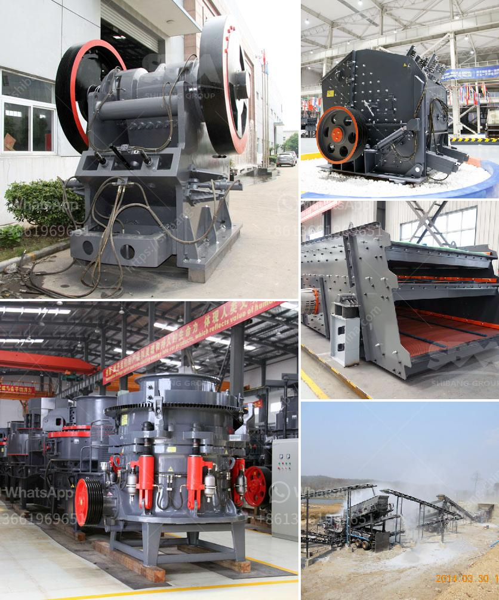

<h3>gold mining mining gold mining cost</h3>
Gold mining has been a prominent economic activity for centuries, with its origins dating back to ancient civilizations. Over time, the process of mining gold has evolved, becoming more efficient and cost-effective. However, despite these advancements, gold mining still incurs significant costs. In this article, we will explore the various factors that contribute to the cost of gold mining, shedding light on the true expenses associated with this industry.

One of the primary costs in gold mining is equipment. Miners rely on heavy machinery and specialized tools to extract gold from the earth. These machines require regular maintenance and occasional replacement, which can be quite expensive. Additionally, the fuel needed to power the equipment adds to the overall cost.

Another major expense in gold mining is labor. Skilled workers are essential for operating the machinery and ensuring the mining process is safe and efficient. The wages of these workers, coupled with benefits and insurance, contribute significantly to the overall cost of gold mining.

Furthermore, exploration costs encompass a substantial portion of the budget. Before mining can commence, extensive research and analysis are conducted to identify potential gold deposits. This involves geological surveys, core sampling, and various other methods to determine the viability of mining in a particular area. These pre-mining activities can be costly and time-consuming.

Moreover, environmental regulations and sustainability practices have added to the cost of gold mining. Mining companies must comply with stringent environmental policies to mitigate the adverse impacts of their operations. Implementing advanced technology and adopting eco-friendly practices often entail additional expenses.

Additionally, logistical costs are a crucial consideration in gold mining. The extraction sites are often located in remote areas, far from major transportation hubs. Consequently, transporting equipment, supplies, and personnel to and from the mining site can be expensive, as it involves long-distance travel, sometimes across challenging terrains.

Furthermore, fluctuations in gold prices can affect the profitability of mining operations. Although gold is considered a valuable commodity, its market value is volatile. Rising or falling prices can significantly impact the overall revenues earned from gold mining.

Lastly, the cost of regulatory compliance plays a significant role. Governments impose various fees, taxes, and royalties on mining companies to ensure they contribute to the local economy and protect the environment. These financial obligations add to the overall cost of gold mining.

In conclusion, gold mining is a complex process that involves significant costs. Equipment, labor, exploration, environmental compliance, logistics, gold price fluctuations, and regulatory expenses all contribute to the overall cost. To ensure profitability, mining companies must carefully analyze these factors and adopt strategies to minimize expenses while maximizing gold recovery. Only through effective cost management can gold mining operations thrive in a highly competitive industry.
<h3>Contact us</h3><ul><li><strong>Whatsapp:&nbsp;<a href="https://wa.me/8613661969651">+8613661969651</a></strong></li><li><a href="https://swt.shibang-china.com/?git&amp;zhl&amp;gold mining mining gold mining cost"><strong>Online Service(chat now)</strong></a></li></ul><h3>Related</h3><ul><li><a href='cone crusher device.md'>cone crusher device</a></li><li><a href='vibro screen machine in ahmedabad.md'>vibro screen machine in ahmedabad</a></li><li><a href='sand crusher company in nigeria.md'>sand crusher company in nigeria</a></li><li><a href='small rock crusher machine for sale.md'>small rock crusher machine for sale</a></li><li><a href='how much is gold hammer mill crusher.md'>how much is gold hammer mill crusher</a></li></ul>