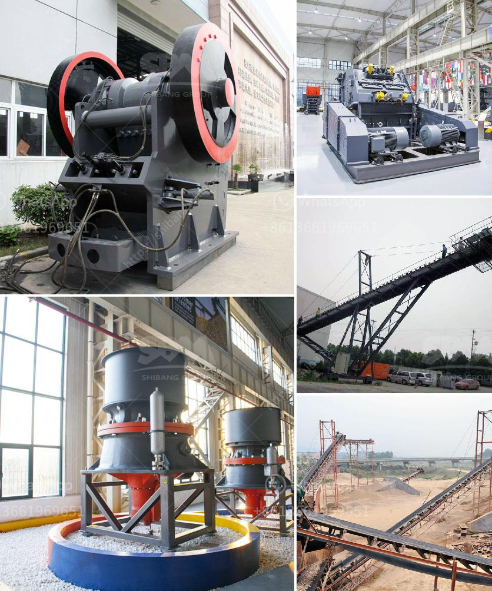

<h3>gold mining price</h3>
Gold mining has been increasingly in the spotlight, as its price experiences an astonishing surge in recent times. This rise is driven by various factors ranging from economic uncertainties to geopolitical tensions. With every ounce of gold dug out, the value of this precious metal continues to climb to new heights, attracting investors and gold enthusiasts alike.

Gold's remarkable performance can be attributed to a combination of supply constraints and increased demand. On the supply side, mining companies face challenges such as declining ore grades and rising production costs. This, coupled with a limited number of major discoveries in recent years, has resulted in a decline in gold output. As a result, the scarcity of new supply has put upward pressure on gold prices.

Simultaneously, gold's safe-haven status has become increasingly valuable during times of uncertainty. Global economic turmoil, political tensions, and fluctuations in traditional asset classes have all contributed to heightened demand for gold. Investors seek the stability and security that gold provides, leading to increased buying activity and additional upward price momentum.

Central banks across the globe have also played a significant role in the gold price surge. Many countries, including emerging economies, have been diversifying their foreign reserves by increasing their gold holdings. With the ongoing volatility in international markets, central banks view gold as a reliable store of value and a hedge against currency fluctuations. Their consistent buying pattern adds momentum to the demand side, further fueling the upward trajectory of gold prices.

The gold mining sector is experiencing an unprecedented renaissance, with the price of gold reaching unprecedented heights. Factors such as supply constraints, increased global demand, and central bank buying have contributed to this sustained surge. For investors, this presents an opportunity to capitalize on the increased gold prices and the potential for further appreciation in the future. However, it is essential to keep in mind that gold prices can be volatile, and market conditions may change. As with any investment, thorough research and risk management strategies are recommended to make informed decisions.

In conclusion, the gold mining industry's recent price surge has provided a bullish breakthrough for precious metal enthusiasts, while also posing a promising opportunity for investors seeking a safe haven amidst an uncertain economic landscape.
<h3>Contact us</h3><ul><li><strong>Whatsapp:&nbsp;<a href="https://wa.me/8613661969651">+8613661969651</a></strong></li><li><a href="https://swt.shibang-china.com/?git&amp;zhl&amp;gold mining price"><strong>Online Service(chat now)</strong></a></li></ul><h3>Related</h3><ul><li><a href='vertical roller mill for cement.md'>vertical roller mill for cement</a></li><li><a href='roller mill machine for mining.md'>roller mill machine for mining</a></li><li><a href='chromite ore flowsheet pdf.md'>chromite ore flowsheet pdf</a></li><li><a href='safety poster for coal handling plant.md'>safety poster for coal handling plant</a></li><li><a href='alluvial wash plants in south africa.md'>alluvial wash plants in south africa</a></li></ul>