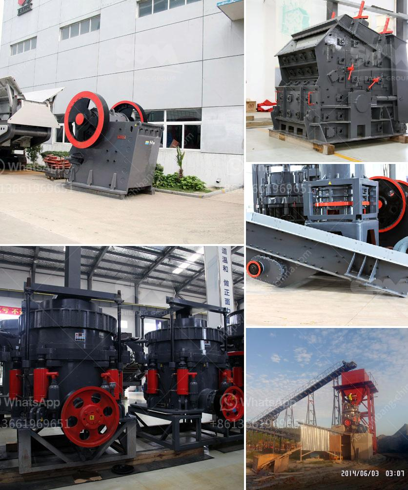

<h3>gold mining production line or gold mining plant</h3>
Gold mining production line, also known as gold mining plant, refers to the processes involved in extracting gold from its ores. While the name may suggest that the process is as simple as finding a gold nugget and extracting it, gold mining production line involves various strategies, techniques, and processes that contribute to its overall efficiency and success.

The first step in a gold mining production line is prospecting. This typically involves geological surveys, analysis of satellite imagery, and exploration drilling to identify potential gold-rich areas. Once a promising location is identified, the second step is to develop a mine. This entails obtaining the necessary permits and licenses, as well as constructing the required infrastructure such as access roads, power supply lines, and processing facilities.

The actual mining process begins with the extraction of the ore from the ground. There are several methods for extracting gold from its ores, depending on the type and location of the deposit. The most common method is cyanide leaching, which involves crushing the ore into smaller particles and then treating it with a dilute cyanide solution. The gold in the ore reacts with the cyanide to form a soluble compound, which is then separated from the other minerals and impurities.

After the gold has been extracted, it undergoes further processing to remove any remaining impurities and to produce a pure, marketable product. This typically involves processes such as smelting, where the gold is melted and refined to improve its purity, and electroplating, where it is coated with a thin layer of gold to enhance its appearance.

Throughout the entire gold mining production line, careful environmental management is crucial to minimize the impact on the surrounding ecosystem. This includes measures such as proper waste disposal, reclamation of mined areas, and the use of environmentally friendly technologies and practices. Many gold mining companies also invest in community development initiatives to ensure that the benefits of the mining operations are shared with the local communities.

In recent years, technological advancements have greatly improved the efficiency and productivity of gold mining production lines. Automated equipment, such as excavators and haul trucks, can handle larger volumes of ore with greater accuracy and speed. Advanced processing techniques, such as carbon-in-pulp and heap leaching, have also contributed to increased gold recovery rates.

Furthermore, the use of digital technologies, such as remote sensing and data analytics, has enabled mining companies to better understand the geology of the deposits, optimize their operations, and reduce costs. For example, real-time monitoring of ore grades and mineralogy allows for adjustments in the mining and processing methods to maximize gold recovery.

In conclusion, a gold mining production line or gold mining plant is a complex and dynamic process that involves various steps, technologies, and environmental considerations. From prospecting to extraction, refining, and final product production, each stage requires careful planning and implementation. With continuous advancements in technology, gold mining production lines are becoming more efficient and environmentally friendly, ensuring the sustainable extraction of this precious metal for years to come.
<h3>Contact us</h3><ul><li><strong>Whatsapp:&nbsp;<a href="https://wa.me/8613661969651">+8613661969651</a></strong></li><li><a href="https://swt.shibang-china.com/?git&amp;zhl&amp;gold mining production line or gold mining plant"><strong>Online Service(chat now)</strong></a></li></ul><h3>Related</h3><ul><li><a href='laboratory grinding mills jaw crushers.md'>laboratory grinding mills jaw crushers</a></li><li><a href='cost for a metal crusher in kerala.md'>cost for a metal crusher in kerala</a></li><li><a href='stone crushing plant 100tph for sale.md'>stone crushing plant 100tph for sale</a></li><li><a href='stone manufacturing process.md'>stone manufacturing process</a></li><li><a href='copper mining in zambia.md'>copper mining in zambia</a></li></ul>