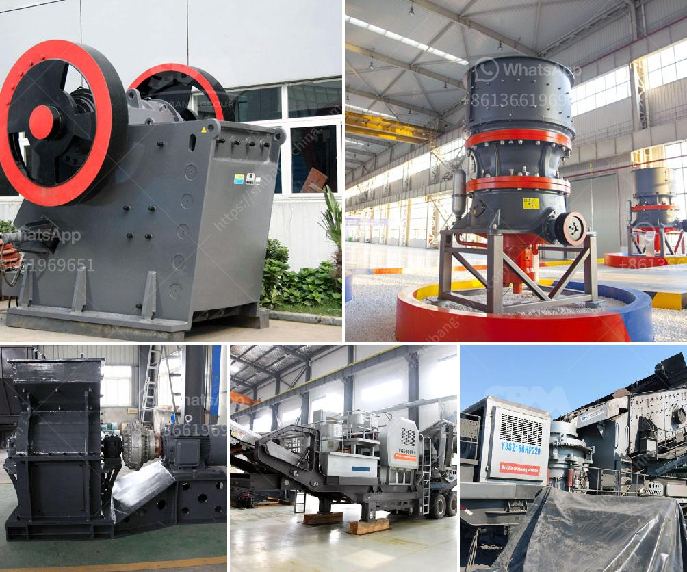

<h3>gold mobile crushing equipment</h3>
The mining industry has always been at the forefront of technological advancements, especially with the constant need to improve extraction and processing techniques. Mobile crushing equipment is a prime example of technology serving the mining sector, as it enables efficient and cost-effective material processing on the go. In this article, we focus on the incredible value gold mobile crushing equipment brings to the industry and how it has revolutionized mining operations worldwide.

Gold mobile crushing equipment offers exceptional versatility, allowing mining operations to process various types of materials on-site. Whether it's hard rock, ore, or construction debris, these cutting-edge machines efficiently extract valuable resources, saving time and money. The ability to move these crushers to different locations with ease promotes productivity by eliminating the need for unnecessary material transportation.

Efficiency is a critical component of any mining operation. Gold mobile crushing equipment maximizes efficiency by streamlining material processing and reducing the need for multiple machines. In one compact unit, these crushers effortlessly separate gold from other materials, eliminating the need for additional processing stages. Consequently, this reduces operational costs, energy consumption, and labor requirements, leading to significant savings.

Gold mobile crushing equipment is designed to minimize its environmental impact. Compact in size, these machines have a smaller footprint, occupying less space at mining sites. Furthermore, modern crushing technology ensures reduced noise emissions, dust generation, and lower energy consumption, creating a cleaner and more sustainable mining environment.

Safety is always a top priority in the mining industry. Gold mobile crushing equipment integrates advanced safety features that protect operators and maintenance personnel. These cutting-edge machines are equipped with state-of-the-art control systems, emergency shut-off switches, and advanced monitoring tools, reducing the risk of accidents and ensuring the well-being of personnel.

Gold mobile crushing equipment has revolutionized the mining industry by offering enhanced versatility, efficiency, cost savings, and safety. Its compact design and eco-friendly features further contribute to sustainable mining practices. As the mining sector continues to evolve, embracing this innovative technology will be crucial to stay ahead in an increasingly competitive landscape. Investing in gold mobile crushing equipment is a strategic move that paves the way for increased productivity, profitability, and environmental responsibility in mining operations worldwide.
<h3>Contact us</h3><ul><li><strong>Whatsapp:&nbsp;<a href="https://wa.me/8613661969651">+8613661969651</a></strong></li><li><a href="https://swt.shibang-china.com/?git&amp;zhl&amp;gold mobile crushing equipment"><strong>Online Service(chat now)</strong></a></li></ul><h3>Related</h3><ul><li><a href='grinding mill for quartz in to 500 mesh in india.md'>grinding mill for quartz in to 500 mesh in india</a></li><li><a href='hammer mill price philippines.md'>hammer mill price philippines</a></li><li><a href='crush stone machinery.md'>crush stone machinery</a></li><li><a href='mining ball mill.md'>mining ball mill</a></li><li><a href='business proposal sample for gold milling.md'>business proposal sample for gold milling</a></li></ul>