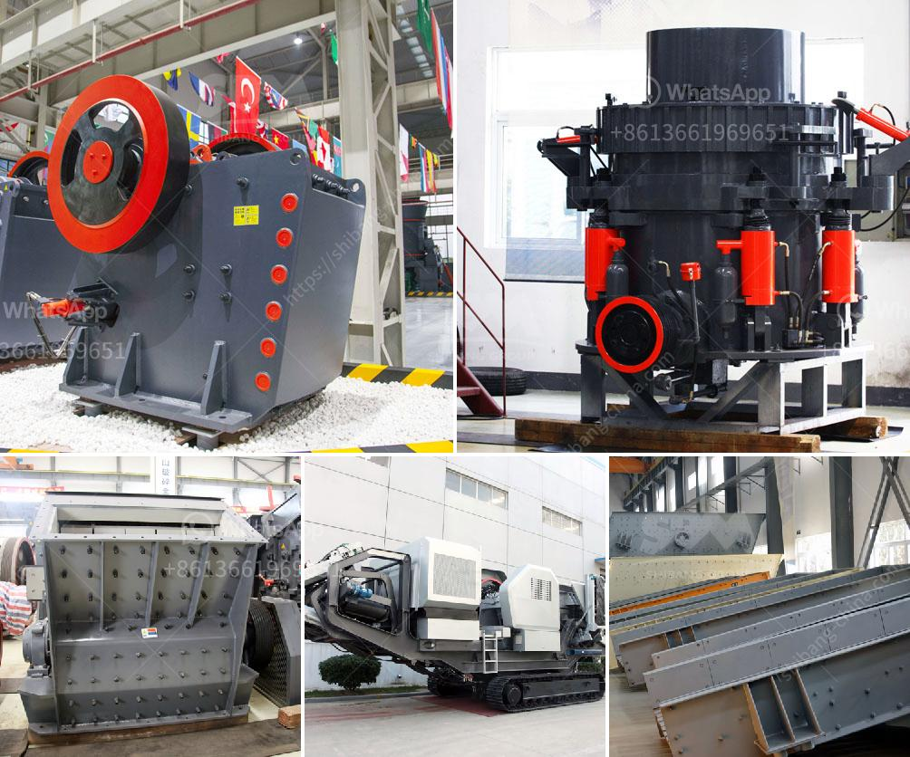

<h3>gold refinery equipment china</h3>
Gold refinery equipment plays a vital role in the extraction, purification, and processing of gold. China, as one of the world's leading producers and consumers of gold, has established itself as a key player in supplying advanced technology and equipment to the global gold refining industry.

Over the past few decades, China has witnessed a substantial increase in gold refining activities, driven by the country's rapid economic growth and growing demand for gold. This surge in the market has necessitated the development and implementation of advanced gold refinery equipment to process the raw gold ore into valuable pure gold.

China's gold refinery equipment manufacturers have been at the forefront of technological advancements in the industry. They have introduced state-of-the-art machinery that streamlines gold processing, enhances efficiency, and ensures maximum extraction of precious metals.

China's gold refinery equipment is renowned for its accuracy, automation, and reliability, providing a sustainable solution for large-scale gold processing operations. From crushing, grinding, and milling to purification and smelting, every step of the refining process is carefully optimized to minimize losses and maximize gold recovery.

Awareness of environmental sustainability has prompted Chinese manufacturers to develop gold refinery equipment that meets stringent emission standards. These equipment manufacturers have incorporated environmentally friendly techniques, such as closed-loop systems, recirculation of water, and advanced gas scrubbers, to minimize pollution and reduce the carbon footprint of the refining process.

China's gold refinery equipment manufacturers have expanded their presence across the globe, exporting their products and collaborating with international partners. This has facilitated the transfer of technology and know-how, enabling smaller refineries in other countries to adopt advanced equipment and drive efficiencies in their own gold refining processes.

The gold refinery equipment industry in China has witnessed remarkable growth, fueled by advancements in technology and a commitment to environmental sustainability. As China continues to lead in gold production and refining, the country's equipment manufacturers will play a pivotal role in providing sophisticated machinery that meets the evolving needs and challenges of the global gold refining industry.
<h3>Contact us</h3><ul><li><strong>Whatsapp:&nbsp;<a href="https://wa.me/8613661969651">+8613661969651</a></strong></li><li><a href="https://swt.shibang-china.com/?git&amp;zhl&amp;gold refinery equipment china"><strong>Online Service(chat now)</strong></a></li></ul><h3>Related</h3><ul><li><a href='vibrating screen size decision.md'>vibrating screen size decision</a></li><li><a href='gold mining machinery.md'>gold mining machinery</a></li><li><a href='gypsum machine price.md'>gypsum machine price</a></li><li><a href='manufacturing process of bentonite powder.md'>manufacturing process of bentonite powder</a></li><li><a href='roller mill machine for mining.md'>roller mill machine for mining</a></li></ul>