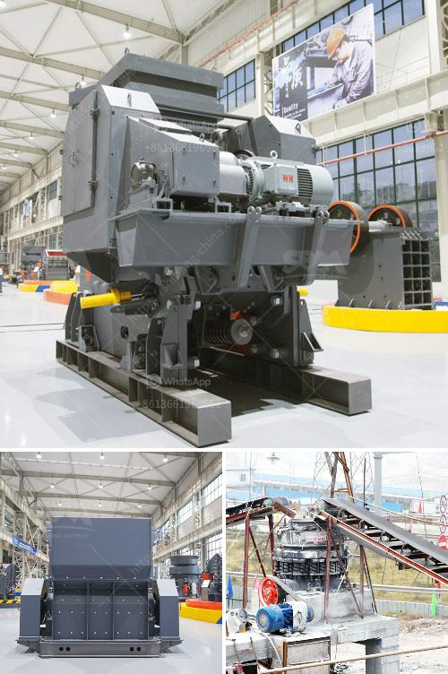

<h3>gold rock crusher plant portable</h3>
Gold rock crusher plant refers to a portable device that is used to crush rocks into small pieces. It is characterized by strong portability, low operating costs, high efficiency, and flexibility. It can be combined into a two-stage crushing and screening system or a three-stage crushing and screening system based on different requirements.

The portable gold rock crusher plant features an integrated design, which is flexible and convenient. This design eliminates the obstacles caused by the crushing site, environment, and complicated basic configuration. It greatly expands the range of rough crushing operation. The integration of the entire unit makes it easy for installation, saving time and effort.

In addition, the portable gold rock crusher plant is equipped with a high-performance vibrating feeder and a jaw crusher, which ensures the crushing process is highly efficient. The jaw crusher is responsible for the first crushing stage, while the vibrating feeder effectively controls the flow of materials. It allows the materials to be evenly transported to the jaw crusher, reducing the occurrence of uneven feeding or blockage.

The portable gold rock crusher plant is equipped with a cone crusher, which is a powerful secondary crushing unit. In addition, this mobile crusher plant is also equipped with a high-performance vibrating screen, ensuring that crushing and screening processes can be completed at one time, which greatly improves the efficiency of the whole production line.

Furthermore, the portable gold rock crusher plant is designed with excellent crushing capacity, making it possible to crush various materials. It is versatile enough to be used in multiple applications, such as a rock crushing plant, concrete batching plant, dry mortar plant, asphalt plant, etc. With this flexibility, it can meet different customers' needs and is suitable for various construction projects.

Another advantage of the portable gold rock crusher plant is its low operating costs. The whole production line is highly automated, reducing manual operation and labor costs. Additionally, the portable gold rock crusher plant uses a diesel engine as a power source, which greatly reduces the fuel consumption. This can result in substantial savings in operating costs, making it an ideal choice for small and medium-sized mining applications.

In conclusion, the portable gold rock crusher plant is a perfect option for crushing and screening operation in mining, quarrying, and construction industry. It features portability, high crushing efficiency, low operating costs, versatile application, and excellent performance. This mobile crushing plant can be easily transported from one location to another, which saves the transportation cost and ensures a quick setup. If you are in the market for a portable rock crusher plant, the gold rock crusher plant will be your best choice.
<h3>Contact us</h3><ul><li><strong>Whatsapp:&nbsp;<a href="https://wa.me/8613661969651">+8613661969651</a></strong></li><li><a href="https://swt.shibang-china.com/?git&amp;zhl&amp;gold rock crusher plant portable"><strong>Online Service(chat now)</strong></a></li></ul><h3>Related</h3><ul><li><a href='jaw crusher machine in saudi.md'>jaw crusher machine in saudi</a></li><li><a href='mobile crusher plant price in india.md'>mobile crusher plant price in india</a></li><li><a href='ceramic mortar powder grinding mill in nigeria.md'>ceramic mortar powder grinding mill in nigeria</a></li><li><a href='mobile coal washing plant south africa.md'>mobile coal washing plant south africa</a></li><li><a href='stone crushing machinery suppliers.md'>stone crushing machinery suppliers</a></li></ul>