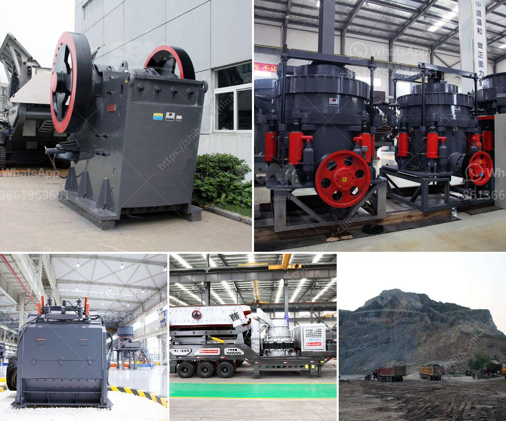

<h3>gold stone crusher images</h3>
Gold stone crusher machines are commonly used on construction sites and in stone quarries to crush large stones into smaller pieces. Crushed stone has a variety of purposes but is often used to make level surfaces, provide drainage under roads and buildings or to produce aggregate or manufactured sand.

Nowadays, gold stone crusher images products have high precision and have become a popular choice among customers. These stone crushers are widely used in construction and mining industries worldwide wherever the raw material is simply crushed. These stone crushers are available in stationary, track-mounted, and mobile designs, and can handle any type of material whether it is soft rock, limestone, or harder granite.

The gold stone crusher images machines up for sale are from the leading sellers and trusted manufacturers, ensuring their durability and reliability. They perform exceptionally well and can work faster than ordinary crushers. Their high-quality cutting-edge features enable them to produce consistent and precise end products. These stone crushers are easy to operate and maneuver, making them portable and convenient for the job site.

One of the key advantages of gold stone crusher images machines is their ability to crush materials directly on-site instead of carrying out the crushing process elsewhere. This not only saves time and transportation costs but also eliminates the need for additional machinery, equipment, and labor. It allows construction companies and quarry owners to reduce their overall expenses and increase their profit margins.

Another crucial factor in favor of gold stone crusher images machines is their capacity to produce a wide variety of sizes of crushed stones. Depending on the specific requirements of the project, these stone crushers can produce various sizes of crushed stones, ranging from 0 to 50mm or even smaller. This versatility ensures that the crushed stone can be used for a wide range of applications. Whether it is for laying foundations, constructing roads, or landscaping gardens, gold stone crusher images machines have got it covered.

Furthermore, gold stone crusher images machines are designed with advanced technology and modern features to enhance their performance and efficiency. Their hydraulic adjustment systems ensure a precise and consistent product size, while their powerful motors enable them to handle even the toughest materials. Additionally, the machines are equipped with multi-functional control panels that allow operators to adjust the settings and monitor the performance in real-time.

In conclusion, gold stone crusher images machines are essential equipment in the construction and mining industries. With their ability to crush materials directly on-site, produce various sizes of crushed stones, and their advanced technology and features, they offer significant advantages over traditional crushers. Investing in these machines can streamline the crushing process, maximize productivity, and ultimately improve the profitability of construction companies and quarry owners.
<h3>Contact us</h3><ul><li><strong>Whatsapp:&nbsp;<a href="https://wa.me/8613661969651">+8613661969651</a></strong></li><li><a href="https://swt.shibang-china.com/?git&amp;zhl&amp;gold stone crusher images"><strong>Online Service(chat now)</strong></a></li></ul><h3>Related</h3><ul><li><a href='puzzolana stone crusher.md'>puzzolana stone crusher</a></li><li><a href='cost of setting up a quarry crusher plant.md'>cost of setting up a quarry crusher plant</a></li><li><a href='grinding machine for marble.md'>grinding machine for marble</a></li><li><a href='raymond mill coal pulverizer.md'>raymond mill coal pulverizer</a></li><li><a href='quartz grinding pulveriser single phase.md'>quartz grinding pulveriser single phase</a></li></ul>