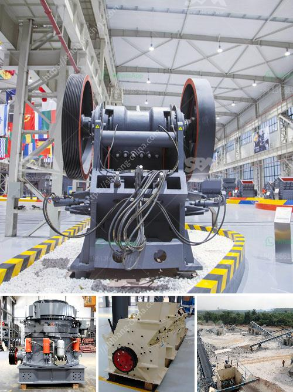

<h3>gold wash plant for sale uk</h3>
Gold mining is a lucrative industry, attracting prospectors and mining enthusiasts all over the world. If you're based in the UK and interested in getting into this field, then a gold wash plant may be just what you need. A gold wash plant is a piece of equipment designed specifically for extracting gold from deposits of soil, sand, and gravel. It uses water and mechanical processes to separate the valuable metal from the unwanted materials, allowing you to collect the precious gold particles.

Finding a gold wash plant for sale in the UK can be a daunting task, but there are reputable companies that offer these machines. These plants come in various sizes and capacities, depending on your needs and the scale of your operations. Some plants are compact and portable, making them suitable for small-scale mining operations or hobbyist prospectors. Others are larger and more heavy-duty, capable of handling larger volumes of material for commercial mining ventures.

When searching for a gold wash plant for sale in the UK, it's important to consider factors such as the plant's capacity, ease of use, durability, and price. You want a plant that can handle the amount of material you plan to process and is built to withstand the rugged conditions of the mining environment. Additionally, look for plants that are easy to operate, as this will ensure smoother workflow and increased efficiency.

Investing in a gold wash plant is a significant decision, and it's crucial to make an informed choice. Consider reading reviews, seeking recommendations from fellow miners, and consulting with experts to ensure you're purchasing a reliable machine. While prices may vary depending on the size and features of the plant, it's advisable to compare different options to find the best value for your money.

With a gold wash plant, you'll have the means to extract gold efficiently and effectively, potentially turning your mining endeavor into a profitable business. So don't hesitate to explore the market for gold wash plants for sale in the UK and set your sights on striking gold.
<h3>Contact us</h3><ul><li><strong>Whatsapp:&nbsp;<a href="https://wa.me/8613661969651">+8613661969651</a></strong></li><li><a href="https://swt.shibang-china.com/?git&amp;zhl&amp;gold wash plant for sale uk"><strong>Online Service(chat now)</strong></a></li></ul><h3>Related</h3><ul><li><a href='primary crusher for sale.md'>primary crusher for sale</a></li><li><a href='silica sand grinding machine cost.md'>silica sand grinding machine cost</a></li><li><a href='enquiry about impact crusher.md'>enquiry about impact crusher</a></li><li><a href='ball mill of small size.md'>ball mill of small size</a></li><li><a href='top german mining equipment manufacturers.md'>top german mining equipment manufacturers</a></li></ul>