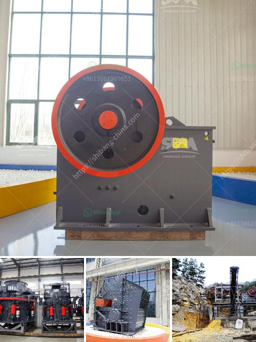

<h3>gold wash plant manufacturer in india</h3>
India has always been a prominent player in the global mining industry. With rich mineral resources, the country has attracted several international mining companies over the years. One such industry that has been thriving in India is gold mining. And when it comes to efficient gold mining equipment, there is one name that stands out – Gold Wash Plant Manufacturer in India.

Gold wash plants are plants specifically designed to extract gold from its ores. This process is achieved by combining various equipment, such as grizzly feeders, mining spirals, trommels, and jigs, into a single pumping system. These plants are commonly used in small to medium-scale gold mining operations, as they provide a cost-effective method to extract gold with minimal environmental impact.

One of the leading gold wash plant manufacturers in India is [Company Name]. They have several years of experience in manufacturing and supplying state-of-the-art gold wash plants to various mining companies across the world. Their gold wash plants are designed with efficiency, durability, and environmental sustainability in mind.

The company utilizes advanced technology and engineering expertise to create efficient gold wash plants. Every component of their plants is carefully designed and tested to ensure optimal performance and maximum gold recovery. From the initial screening process to the final separation, their plants are built to endure rigorous mining conditions while maintaining high recovery rates.

In addition to their technical prowess, [Company Name] also places great emphasis on environmental sustainability. Their gold wash plants are designed to minimize water usage, energy consumption, and overall environmental impact. They incorporate features such as recycling water systems, minimal use of chemicals, and efficient waste management to ensure that gold mining operations are conducted responsibly and with minimal harm to the environment.

Moreover, [Company Name] provides comprehensive customer support and after-sales service. They work closely with their clients to understand their specific requirements and customize their gold wash plants accordingly. Their team of experts is always available to provide technical assistance, maintenance support, and operator training to ensure smooth and efficient operation of their plants.

The gold wash plants manufactured by [Company Name] have gained global recognition for their superior quality and performance. They have successfully supplied their plants to mining companies in India as well as in other countries, where their plants have been instrumental in the extraction of gold from the earth.

In conclusion, gold wash plants play a crucial role in the gold mining industry, and the gold wash plant manufacturer in India, [Company Name], has established itself as a leading player in this sector. With their focus on efficiency, durability, and environmental sustainability, they are committed to providing the best solutions for gold mining operations. Their expertise, technical prowess, and customer support have earned them a reputable position in the global market, making them a reliable choice for gold mining companies seeking quality wash plant equipment.
<h3>Contact us</h3><ul><li><strong>Whatsapp:&nbsp;<a href="https://wa.me/8613661969651">+8613661969651</a></strong></li><li><a href="https://swt.shibang-china.com/?git&amp;zhl&amp;gold wash plant manufacturer in india"><strong>Online Service(chat now)</strong></a></li></ul><h3>Related</h3><ul><li><a href='beneficiation plant process line diagram.md'>beneficiation plant process line diagram</a></li><li><a href='crusher equipment supplier.md'>crusher equipment supplier</a></li><li><a href='industrial mining jaw crushers south africa.md'>industrial mining jaw crushers south africa</a></li><li><a href='hammer crusher price one ton per hour.md'>hammer crusher price one ton per hour</a></li><li><a href='machinery to crush quartz.md'>machinery to crush quartz</a></li></ul>