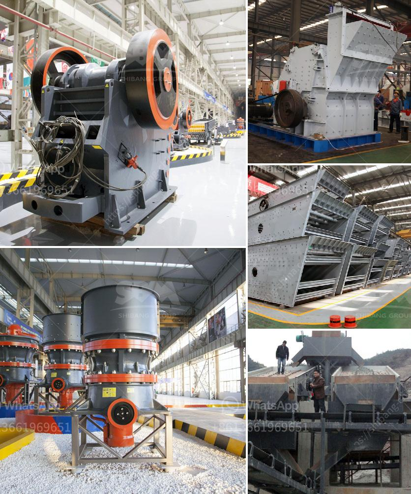

<h3>granite and marble factory for sale</h3>
Are you considering investing in a lucrative business opportunity? Perhaps the idea of owning a granite and marble factory has caught your attention. This industry offers great potential for growth and profitability. Whether you are an established investor looking for a new venture or someone with a passion for the beauty of natural stones, the sale of a granite and marble factory is undoubtedly an exciting prospect.

A granite and marble factory is a crucial part of the construction and interior design industry. These factories specialize in cutting, shaping, and finishing granite and marble to be used in various applications such as countertops, flooring, and decorative pieces. With the increasing demand for natural stone products, owning a factory can lead to substantial profits.

One of the main advantages of investing in a granite and marble factory is the long-term market potential. Granite and marble have been popular choices for homeowners and construction projects for centuries, and this trend is showing no signs of slowing down. The durability, elegance, and unique patterns of these stones make them highly sought after in the market.

Additionally, the construction industry's growth, particularly in emerging economies, contributes to the consistent demand for granite and marble products. As more buildings and infrastructures are being constructed worldwide, the need for high-quality natural stone is expected to rise.

The sale of a granite and marble factory provides an opportunity to join this thriving industry with an established business. When purchasing an existing factory, you benefit from several advantages. Firstly, the factory likely already has a customer base and a reputation in the market, saving you from the challenges of building a brand from scratch. This allows you to focus on expanding the business and meeting the demands of existing customers.

Furthermore, an existing factory should also have the necessary equipment and infrastructure in place, reducing the start-up costs associated with setting up a new facility. You will have access to cutting-edge machinery and technology used in the stone cutting and fabrication process, ensuring efficient operations and high-quality output.

However, it is crucial to conduct thorough due diligence before purchasing a granite and marble factory. Evaluate the financial records to determine the profitability and viability of the business. Understand the market dynamics, competition, and potential growth prospects in the area. Additionally, assess the condition of the equipment and facility to avoid any unexpected costs or repairs.

If you are passionate about interior design or construction, and have a keen eye for the beauty of natural stones, owning a granite and marble factory can be a rewarding and profitable venture. The sale of such a factory presents a unique opportunity for entrepreneurs and investors looking to join a growing industry with a strong market demand. With careful research and planning, you could be on your way to owning a successful granite and marble factory and reaping the rewards of an investment in this promising sector.
<h3>Contact us</h3><ul><li><strong>Whatsapp:&nbsp;<a href="https://wa.me/8613661969651">+8613661969651</a></strong></li><li><a href="https://swt.shibang-china.com/?git&amp;zhl&amp;granite and marble factory for sale"><strong>Online Service(chat now)</strong></a></li></ul><h3>Related</h3><ul><li><a href='cement plant process in south africa.md'>cement plant process in south africa</a></li><li><a href='portable gold recovery mill for sale.md'>portable gold recovery mill for sale</a></li><li><a href='stone crusher specification.md'>stone crusher specification</a></li><li><a href='small stone crusher plant in india.md'>small stone crusher plant in india</a></li><li><a href='turkey stone crushers.md'>turkey stone crushers</a></li></ul>