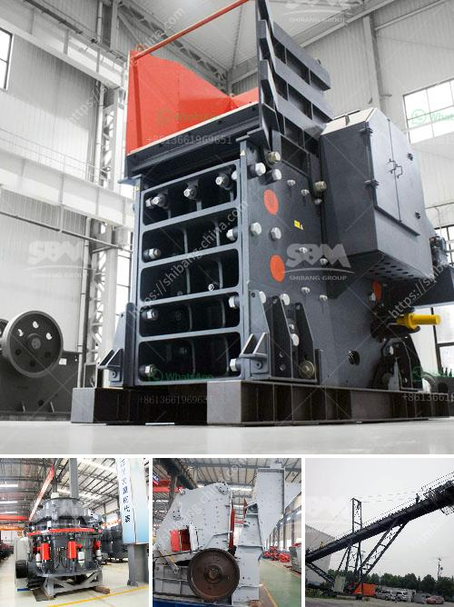

<h3>granite crusher for sales</h3>
Granite is a common type of intrusive, felsic, igneous rock that is granular and phaneritic in texture. This rock consists mainly of quartz, mica, and feldspar. Granite is widely recognized for its durability, natural beauty, and elegance, making it an ideal material for construction and decorative purposes.

One specific application of granite is its use as a raw material for the production of granite crusher. These crushers are heavy-duty machines that are primarily used to break down granite into smaller pieces for various construction applications. Granite crushers are widely used in mining, metallurgy, building materials, roads, railways, water conservancy, and chemical industries.

One popular model of granite crusher for sales is the PE series jaw crusher, which is widely used in the industry of mining, metallurgy, and quarrying. This machine has a compression strength of less than 320MPa and a maximum feed size of 125mm-1020mm. With its advantages of high crushing ratio, reliable performance, and easy maintenance, the PE series jaw crusher has been well-received by customers.

Another widely used granite crusher is the PF series impact crusher. This machine has a crushing cavity that produces cubic-shaped end products. It has a feeding size of 250mm-500mm and a capacity of 15-350TPH. Due to its excellent performance and reliability, the PF series impact crusher has gained popularity among customers who seek efficient and quality crushing equipment.

When purchasing granite crushers, it is crucial to consider factors such as production capacity, energy consumption, and maintenance costs. It is advisable to choose reliable manufacturers or suppliers who can provide professional guidance and after-sales service to ensure the smooth operation of the equipment.

In summary, granite crushers play a significant role in the construction industry. Their ability to break down granite into smaller, more manageable pieces makes them essential for various construction applications. Buyers should carefully select granite crushers based on their specific needs and consult professionals to make informed decisions.
<h3>Contact us</h3><ul><li><strong>Whatsapp:&nbsp;<a href="https://wa.me/8613661969651">+8613661969651</a></strong></li><li><a href="https://swt.shibang-china.com/?git&amp;zhl&amp;granite crusher for sales"><strong>Online Service(chat now)</strong></a></li></ul><h3>Related</h3><ul><li><a href='vertical ball mill.md'>vertical ball mill</a></li><li><a href='how much does sand processing plant cost.md'>how much does sand processing plant cost</a></li><li><a href='quartz powder making machine in andhra pradesh.md'>quartz powder making machine in andhra pradesh</a></li><li><a href='complete crusher plant for sale.md'>complete crusher plant for sale</a></li><li><a href='stone crusher for road construction.md'>stone crusher for road construction</a></li></ul>