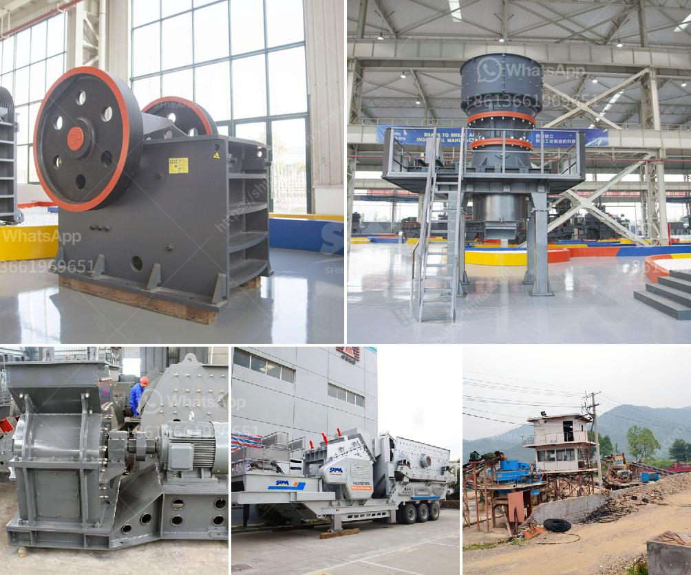

<h3>granite crusher processing machines south africa</h3>
Granite is an igneous rock formed from the cooling and solidification of magma deep beneath the Earth's crust. This natural stone is known for its durability, strength, and unique aesthetic appeal, making it a popular choice for various applications such as countertops, flooring, and building materials. In South Africa, granite is abundant and widely used in construction projects, making the granite crusher processing machines essential for granite processing.

Granite is fed into the jaw crusher for primary crushing by the vibrating feeder, then the coarsely crushed materials are conveyed to the cone crusher by the belt conveyor for secondary crushing. The finely crushed granite is sent to the vibrating screen for screening, and several different sizes of stones are classified according to the particle size. The qualified granularities will be transported to the final product stack and unqualified materials will be returned to the cone crusher for re-crushing.

In addition to the primary and secondary crushing stages, granite processing machines in South Africa also include vibrating feeders, vibrating screens, and belt conveyors. The grading machine is used to classify the different particle sizes of the granite, and the belt conveyor is responsible for conveying the granite crushed stone into the required particle size.

With the continuous development of infrastructure construction in South Africa, the demand for granite is increasing, so the investment in granite processing machines is also increasing. A reliable and efficient granite crusher processing machine can greatly improve the granite processing efficiency and reduce the investment cost. In addition, it can also simplify the crushing process and save operation time and energy.

In conclusion, granite crusher processing machines are essential for granite processing in South Africa. The granite crusher processing machines are various and their functions are different. No matter which type of granite processing machine is used, the overall technical level should be ensured to meet the production requirements. With the advanced technology and excellent performance, the granite crusher processing machines in South Africa are favored by numerous investors and have a broad market prospect.
<h3>Contact us</h3><ul><li><strong>Whatsapp:&nbsp;<a href="https://wa.me/8613661969651">+8613661969651</a></strong></li><li><a href="https://swt.shibang-china.com/?git&amp;zhl&amp;granite crusher processing machines south africa"><strong>Online Service(chat now)</strong></a></li></ul><h3>Related</h3><ul><li><a href='sand washing plant 50 ton day.md'>sand washing plant 50 ton day</a></li><li><a href='vibrating feeder vs belt conveyor.md'>vibrating feeder vs belt conveyor</a></li><li><a href='200tph gold ore processing plant.md'>200tph gold ore processing plant</a></li><li><a href='ball mills for sale.md'>ball mills for sale</a></li><li><a href='stone crushing plant sale.md'>stone crushing plant sale</a></li></ul>