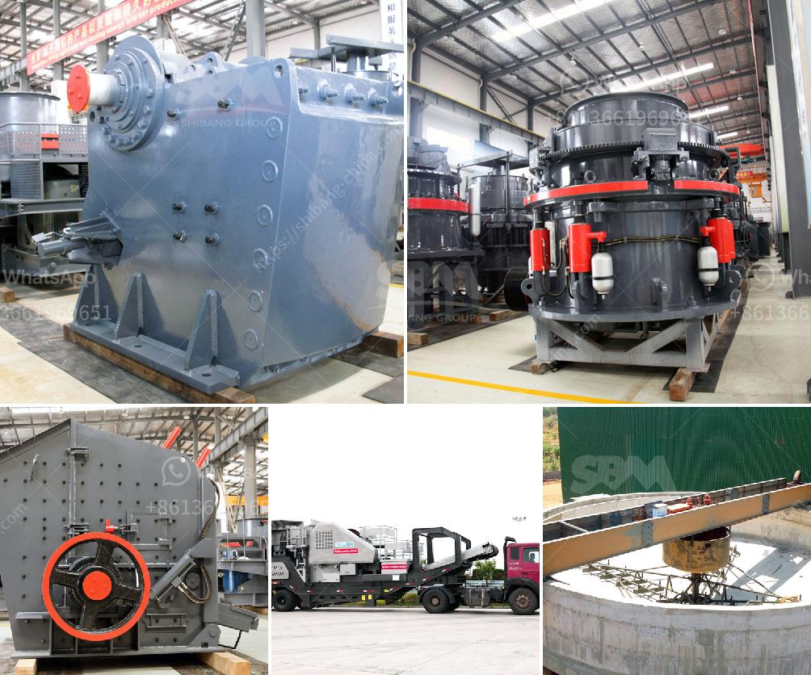

<h3>granite crusher technology</h3>
Granite is an igneous rock that is extensively used for construction purposes. It is composed primarily of quartz and feldspar, and is formed when magma cools deep in the earth's crust. The durability and aesthetic appeal of granite make it a popular choice for countertops, flooring, and many other applications.

To meet the growing demand for granite, efficient crushing equipment is crucial in the granite processing plant. As a leading crushing equipment manufacturer, we can provide a wide range of high-quality granite crushers for our customers to meet their different crushing requirements.

One of the key advantages of our crusher technology is that it provides a highly efficient and reliable crushing process. Granite is a hard and tough rock, and it can easily withstand the high compression forces generated during the crushing process. This is why granite crushers are so widely used in granite processing plants.

Our granite crushing equipment incorporates advanced technology to optimize the crushing efficiency. For example, the unique crushing cavity design makes the crusher machine more efficient by allowing the continuous flow of materials. This reduces the clogging and improves the overall crushing capacity.

In addition to efficient crushing, our granite crushers also ensure high-quality end products. The advanced technology used in our crushers, such as the hydraulic adjustment system, helps to produce uniform particle size distribution and shape. This means that the end products from our crushers are of consistent quality and can be used directly in various construction applications without further processing.

Furthermore, our granite crushers are designed with safety in mind. The machines are equipped with multiple safety features to protect the operators and minimize the risk of accidents. For instance, the hydraulic automatic reset system can automatically adjust the crusher settings to prevent damage caused by non-crushable materials. Additionally, the overload protection system stops the crusher from operating when it encounters excessive load, ensuring the safety of both the machine and the operators.

Apart from the efficient and reliable performance, our granite crushers are also highly versatile. They can handle various types of granite with different hardness levels, from soft to extremely hard. This ensures that our crushers can process different types of granite with consistent efficiency, regardless of the specific characteristics of the rock.

In conclusion, granite crusher technology plays a crucial role in the granite processing industry. It allows for efficient crushing, high-quality end products, and enhanced safety. Whether it is used for countertops or road construction, granite crushers have become an essential tool for modern construction projects. With continuous advancements in crusher technology, we can expect further improvements in efficiency, productivity, and environmental sustainability in the granite industry.
<h3>Contact us</h3><ul><li><strong>Whatsapp:&nbsp;<a href="https://wa.me/8613661969651">+8613661969651</a></strong></li><li><a href="https://swt.shibang-china.com/?git&amp;zhl&amp;granite crusher technology"><strong>Online Service(chat now)</strong></a></li></ul><h3>Related</h3><ul><li><a href='manufacturing artificial sand in malaysia.md'>manufacturing artificial sand in malaysia</a></li><li><a href='quotation for minimum quary plant.md'>quotation for minimum quary plant</a></li><li><a href='ton per hour gold wash plants.md'>ton per hour gold wash plants</a></li><li><a href='stone crusher machines ebay.md'>stone crusher machines ebay</a></li><li><a href='the cost to construct a cement factory.md'>the cost to construct a cement factory</a></li></ul>