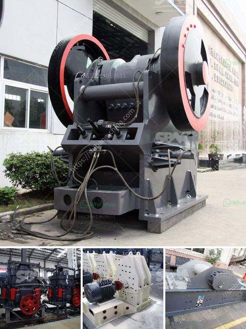

<h3>granite crushing plant for sale in south africa</h3>
Granite is one of the most abundant rocks in the earth's crust, but it is not widely distributed in South Africa. This geological anomaly makes it quite expensive to extract granite in the country. Therefore, local producers of granite are limited to areas where this luxurious stone is found in abundance. South Africa's granite deposits are concentrated around the Bushveld Igneous Complex, where illicit plenty lies beneath the surface.

The demand for granite is high in South Africa, as it is used in various construction projects and architectural designs. In fact, the country is a net exporter of granite products, especially kitchen countertops, vanity tops, and tombstones. With such a high demand for this versatile stone, the need for a granite crushing plant to enable investors to obtain granite from locally available sources has become crucial.

Granite crushing plants are operated all over the country, and there are several suppliers offering this service. However, not all of them can provide excellent quality and reliable plants. It is important for potential buyers to consider factors such as the reputation of the supplier, the durability and efficiency of the plant, and the after-sales services provided.

When investing in a granite crushing plant for sale in South Africa, it is important to choose a reliable service provider that offers top-notch quality products. With 30 years of experience, Shibo Machinery ensures the highest level of craftsmanship and customer satisfaction. Our granite crushing plants are equipped with the latest technology and are built to withstand the most demanding conditions. Furthermore, we provide comprehensive after-sales services, including maintenance, repairs, and spare parts supply.

With Shibo Machinery, investors can invest in a granite crushing plant in South Africa with confidence. Our team of experts will guide you through the process, from selecting the right plant for your needs to ensuring its smooth operation. Don't miss out on the opportunity to secure a reliable source of granite for your construction projects. Contact Shibo Machinery today!
<h3>Contact us</h3><ul><li><strong>Whatsapp:&nbsp;<a href="https://wa.me/8613661969651">+8613661969651</a></strong></li><li><a href="https://swt.shibang-china.com/?git&amp;zhl&amp;granite crushing plant for sale in south africa"><strong>Online Service(chat now)</strong></a></li></ul><h3>Related</h3><ul><li><a href='granite crusher processing machines south africa.md'>granite crusher processing machines south africa</a></li><li><a href='how to process quartz ore crusher.md'>how to process quartz ore crusher</a></li><li><a href='technical parametres of impact crusher.md'>technical parametres of impact crusher</a></li><li><a href='cyclone sand separator for sand mining.md'>cyclone sand separator for sand mining</a></li><li><a href='barite crusher machinery.md'>barite crusher machinery</a></li></ul>