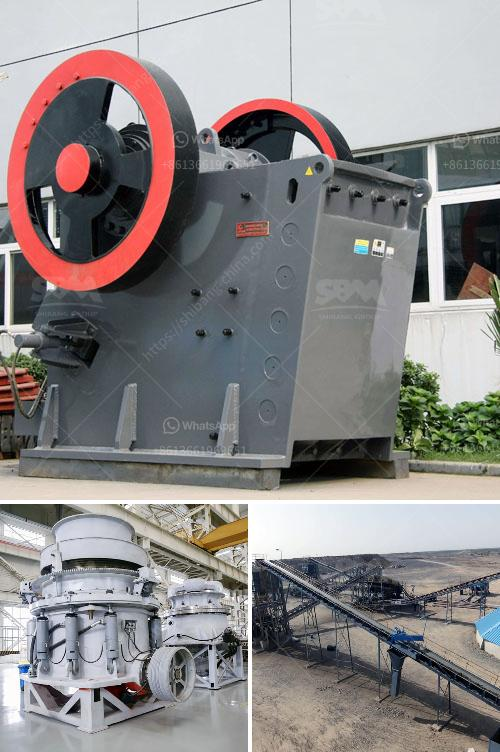

<h3>granite grinding mill</h3>
Granite, known for its hardness and durability, is a popular choice among homeowners and contractors for various applications, including countertops, flooring, and monuments. However, granite is also used in industrial settings, particularly in the manufacturing of grinding mills. These mills play a crucial role in various industries, including mining, construction, and agriculture. In this article, we will explore the features and benefits of a granite grinding mill.

A granite grinding mill is a machine that grinds minerals and other materials into a fine powder. It consists of a heavy-duty granite stone and a rotating grinding wheel that forcefully crushes and grinds the material. The efficiency of the mill depends on the hardness and texture of the material being processed. Granite, being one of the hardest materials, ensures high efficiency and durability of the grinding mill.

One of the major benefits of using a granite grinding mill is its longevity. Granite is resistant to wear, ensuring that the grinding mill can withstand the rigors of continuous operation and heavy loads. This durability translates into lower maintenance costs and enhanced productivity.

Another advantage of a granite grinding mill is its ability to produce a consistent and fine powder. The hardness of granite ensures that the grinding process is efficient and produces a uniform particle size. This is crucial in industries such as mining and construction, where consistent quality is required.

Additionally, granite grinding mills are environmentally friendly. Unlike mills made from synthetic materials, granite mills do not release harmful particles or chemicals during operation. This makes them a safer and cleaner option for processing materials.

In conclusion, a granite grinding mill is essential equipment for industries that rely on grinding and pulverizing materials. Its hardness, durability, and ability to produce a consistent and fine powder make it a valuable asset for various applications. Whether used in mining, construction, or agriculture, a granite grinding mill offers efficiency, durability, and environmental benefits.
<h3>Contact us</h3><ul><li><strong>Whatsapp:&nbsp;<a href="https://wa.me/8613661969651">+8613661969651</a></strong></li><li><a href="https://swt.shibang-china.com/?git&amp;zhl&amp;granite grinding mill"><strong>Online Service(chat now)</strong></a></li></ul><h3>Related</h3><ul><li><a href='small scale gold process pictures.md'>small scale gold process pictures</a></li><li><a href='stone crusher for road construction.md'>stone crusher for road construction</a></li><li><a href='small ball mill for cement clinker grinding india.md'>small ball mill for cement clinker grinding india</a></li><li><a href='quarry equipment cost.md'>quarry equipment cost</a></li><li><a href='mobile crushers stone in south africa.md'>mobile crushers stone in south africa</a></li></ul>