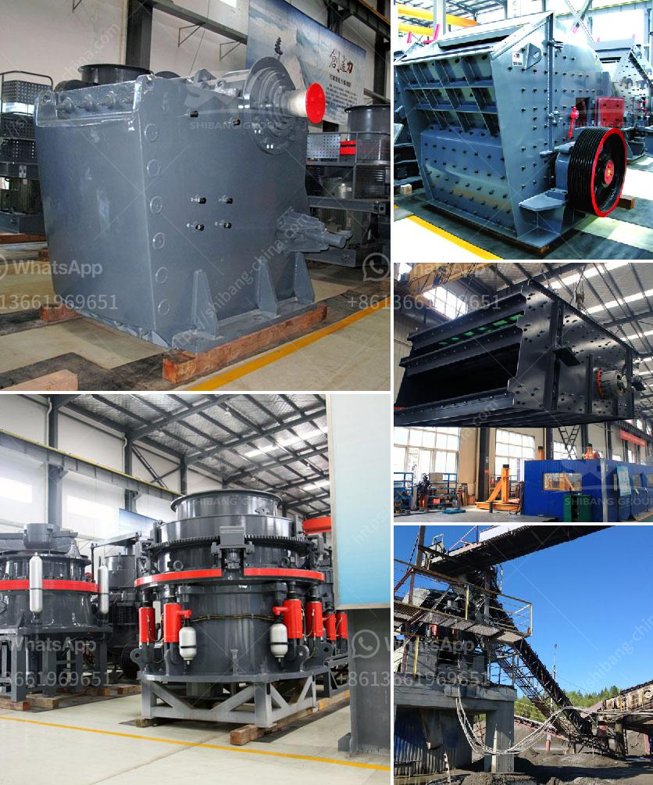

<h3>granite gypsum quarry</h3>
When one thinks of a quarry, the image of strong, sturdy rocks being extracted from the ground comes to mind. These rocks have played a significant role in the construction industry, adding durability and strength to structures for centuries. One such quarry that stands out is the granite gypsum quarry, an excavation site that showcases the bountiful resources Earth has to offer.

Located in a picturesque setting surrounded by lush greenery and rolling hills, the granite gypsum quarry is a sight to behold. The site is renowned for its granite extraction, which is a testament to the geological wonders that lie beneath the surface. Granite, with its unique composition and durability, has been utilized in various architectural and design applications throughout history.

The quarry is a treasure trove of granite in various colors, catering to the diverse needs of customers and architects. From vibrant reds and browns to timeless whites and grays, each granite block extracted from this quarry boasts its distinct charm. Its aesthetic appeal, coupled with the inherent strength of granite, makes it a popular choice for both commercial and residential projects.

However, what sets the granite gypsum quarry apart is its unique combination of granite and gypsum. Gypsum, a soft mineral known for its translucent properties, adds a touch of elegance to the already exquisite granite. The quarry's strategic location allows for the extraction of both these minerals simultaneously, providing designers and architects with a one-of-a-kind treasure trove.

Beyond its aesthetic appeal, the quarry also prides itself on its commitment to sustainable practices and environmental stewardship. The operators of the quarry prioritize responsible extraction techniques to minimize any negative impact on the surrounding ecosystem. They ensure that the excavation process does not disturb the natural balance of the environment, preserving the area's biodiversity.

Furthermore, the granite gypsum quarry aims to utilize modern technologies to enhance its operations. By implementing efficient machinery and sustainable energy sources, the quarry embraces innovation while reducing its carbon footprint. This commitment to environmental responsibility is a testament to the operators' dedication to the preservation of Earth's finite resources.

The granite gypsum quarry also recognizes the importance of community engagement. It endeavors to be an inclusive and responsible member of the local community, supporting local businesses and providing employment opportunities. The quarry actively contributes to the region's economy, fostering growth and development in the surrounding areas.

In conclusion, the granite gypsum quarry is more than just an excavation site. It represents the potential Earth holds and serves as a reminder of the remarkable resources we have at our disposal. Its unique combination of granite and gypsum, coupled with its commitment to sustainability and community engagement, sets it apart from other quarries. The granite gypsum quarry truly honors Earth's bounty, offering a glimpse into the earth's natural wonders while leaving a positive impact on the environment and the community it serves.
<h3>Contact us</h3><ul><li><strong>Whatsapp:&nbsp;<a href="https://wa.me/8613661969651">+8613661969651</a></strong></li><li><a href="https://swt.shibang-china.com/?git&amp;zhl&amp;granite gypsum quarry"><strong>Online Service(chat now)</strong></a></li></ul><h3>Related</h3><ul><li><a href='barite mill specifications.md'>barite mill specifications</a></li><li><a href='processing of platinum ore flow sheet.md'>processing of platinum ore flow sheet</a></li><li><a href='sand crusher company in nigeria.md'>sand crusher company in nigeria</a></li><li><a href='rotary kilns in indonesia.md'>rotary kilns in indonesia</a></li><li><a href='cone crusher secondary price.md'>cone crusher secondary price</a></li></ul>