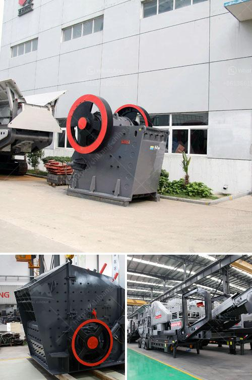

<h3>granite rock sand machinery</h3>
Granite is a common type of igneous rock that is widely distributed throughout the Earth's crust. It is primarily composed of quartz and feldspar, with small amounts of mica and other minerals. Due to its durability and appealing aesthetics, granite has been a popular choice for construction and decorative purposes for centuries.

When it comes to extracting granite from the earth and transforming it into useful materials, such as sand, specialized machinery plays a crucial role. Granite rock sand machinery refers to the equipment specifically designed for shaping granite materials into sand-sized particles. These machines are typically used in various construction projects, such as building foundations, roads, and bridges. In this article, we will explore the different types of granite rock sand machinery and their importance in the construction industry.

One of the essential machines used in the granite rock sand machinery is the jaw crusher. It is a primary crushing equipment that utilizes compressive force to reduce large chunks of granite into smaller sizes. The crushed granite fragments are then sent to a cone crusher or impact crusher for further crushing. These secondary crushers help achieve the desired particle size and shape for producing high-quality granite sand. Additionally, rotary crushers can also be used to accomplish the same purpose.

After the granite rock is reduced to the desired size by the crushers, it undergoes a process called screening. This step involves separating the larger particles from the smaller ones to obtain uniformly sized granite sand. Vibrating screens are commonly utilized for this purpose, as they efficiently separate different-sized materials through vibration and mechanical screening.

Once the granite sand is obtained, it may undergo further processing or refinement to enhance its quality. This can involve techniques such as washing, grading, and drying. Washing helps eliminate impurities and unwanted materials from the sand, ensuring a clean and high-quality product. On the other hand, grading involves separating the sand into different particle sizes, allowing it to be used for specific purposes.

As technology has advanced, various advancements have been made in granite rock sand machinery. For instance, many modern machines now come with automated systems that allow for efficient and precise operation. This not only improves productivity but also reduces the risk of human error. Additionally, the use of advanced materials and components in the machinery ensures durability and longevity, even under harsh working conditions.

In conclusion, granite rock sand machinery plays a vital role in the construction industry, enabling the extraction, processing, and refinement of granite into sand-sized particles. From jaw crushers to vibrating screens, these machines are designed to efficiently shape granite materials and produce high-quality granite sand. As the demand for construction materials continues to rise, the use of granite rock sand machinery becomes even more critical to meet these requirements. With ongoing advancements in technology, the industry can continuously improve its productivity and produce granite sand that meets and exceeds customers' expectations.
<h3>Contact us</h3><ul><li><strong>Whatsapp:&nbsp;<a href="https://wa.me/8613661969651">+8613661969651</a></strong></li><li><a href="https://swt.shibang-china.com/?git&amp;zhl&amp;granite rock sand machinery"><strong>Online Service(chat now)</strong></a></li></ul><h3>Related</h3><ul><li><a href='used ball milling machine for sale canada.md'>used ball milling machine for sale canada</a></li><li><a href='granite gypsum quarry.md'>granite gypsum quarry</a></li><li><a href='talcum powder bp usp manufacturers in india.md'>talcum powder bp usp manufacturers in india</a></li><li><a href='crusher hp300 cone.md'>crusher hp300 cone</a></li><li><a href='rock crusher and screens philippines.md'>rock crusher and screens philippines</a></li></ul>