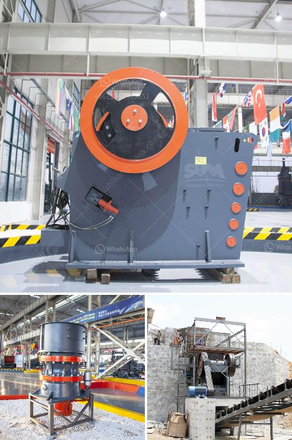

<h3>granite rocks quarry company iyuku edo state</h3>
Granite Rocks Quarry Company is a reputable company in the mining industry, located in Iyuku, Edo State, Nigeria. The company is highly esteemed for its extensive experience in the mining industry. With a solid reputation as a quality-focused organization, the company is a proud producer of granite aggregates for construction and road projects.

Granite rocks are a crucial ingredient in the construction sector as they are widely used for building and infrastructural development. The durability and strength of granite make it a popular choice for various construction projects. The demand for high-quality granite aggregates is a driving force behind the success of Granite Rocks Quarry Company.

The company operates under strict adherence to international standards and best practices. It has invested heavily in modern mining equipment and machinery to ensure efficient operations and maintain a consistent supply of granite aggregates. The mining process is carefully executed to mitigate any negative environmental impact, ensuring sustainable practices are followed.

In addition to its commitment to quality production, Granite Rocks Quarry Company places a strong emphasis on safety. The well-being of its employees and contractors is prioritized at all times. Proper safety protocols, including regular training, are implemented to ensure a safe working environment.

Furthermore, the company is actively involved in corporate social responsibility initiatives. It provides employment opportunities to local communities, contributing to the growth and development of the region. Granite Rocks Quarry Company also supports community projects, such as schools and healthcare facilities, as part of its commitment to social development.

In conclusion, Granite Rocks Quarry Company in Iyuku, Edo State, is a reputable mining organization focused on delivering high-quality granite aggregates for construction purposes. With its commitment to best practices, safety, and community development, the company has established itself as a trusted and reliable supplier in the industry.
<h3>Contact us</h3><ul><li><strong>Whatsapp:&nbsp;<a href="https://wa.me/8613661969651">+8613661969651</a></strong></li><li><a href="https://swt.shibang-china.com/?git&amp;zhl&amp;granite rocks quarry company iyuku edo state"><strong>Online Service(chat now)</strong></a></li></ul><h3>Related</h3><ul><li><a href='saudi arabia used conveyor belts price.md'>saudi arabia used conveyor belts price</a></li><li><a href='stone crushing machine in kenya.md'>stone crushing machine in kenya</a></li><li><a href='gold mining price.md'>gold mining price</a></li><li><a href='mining machinery manufacturer in italy.md'>mining machinery manufacturer in italy</a></li><li><a href='rock crushing price.md'>rock crushing price</a></li></ul>