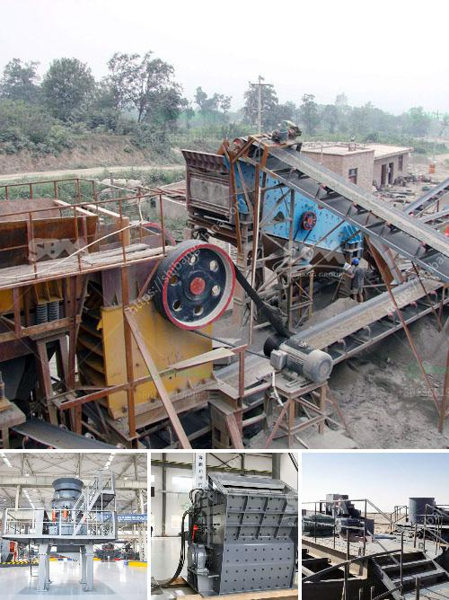

<h3>graphite mining equipment</h3>
Graphite is a natural form of carbon characterized by its hexagonal crystalline structure. It is extracted using both open pit and underground mining methods. Although the naturally occurring ore is abundantly found and mined in many countries, including the U.S., the largest producer of graphite is China, followed by India.

To extract graphite, the ore is first crushed and then treated with alkaline substances to remove impurities. Once purified, it undergoes a process called flotation, in which air bubbles attach themselves to the graphite particles and float them to the surface for further purification. The purified graphite is then dried, graded, and packaged for various industrial applications.

Graphite mining equipment comes in various shapes and sizes. Most mining companies employ industrial-sized crushers and mills to ensure the material is thoroughly processed and ground to a suitable fineness. Continuous operation of these machines is crucial to ensure a steady supply of graphite for various industries.

Also, there are specialized machines used in the extraction and transportation of graphite. Excavators and loaders are commonly employed for open-pit mining, while underground mining usually requires drilling rigs and transport vehicles capable of navigating confined spaces.

In recent years, technological advancements have revolutionized the mining process. Automation and remote control systems now enable miners to operate machinery from a safe distance, improving safety standards in the industry. Additionally, advancements in sensor technologies allow for real-time data collection, helping companies optimize their operations and reduce environmental impacts.

The growing demand for graphite, especially for the production of lithium-ion batteries used in electric vehicles, has led to an increased focus on efficient and sustainable mining practices. Many companies are investing in environmentally friendly equipment, such as electric-powered vehicles and renewable energy systems, to minimize their carbon footprint.

In conclusion, graphite mining equipment plays a crucial role in extracting and processing this versatile material. With the advancements in technology, mining companies are embracing sustainable practices to meet the rising demand for graphite while minimizing their environmental impact.
<h3>Contact us</h3><ul><li><strong>Whatsapp:&nbsp;<a href="https://wa.me/8613661969651">+8613661969651</a></strong></li><li><a href="https://swt.shibang-china.com/?git&amp;zhl&amp;graphite mining equipment"><strong>Online Service(chat now)</strong></a></li></ul><h3>Related</h3><ul><li><a href='manufacturer of clinker grinding machine.md'>manufacturer of clinker grinding machine</a></li><li><a href='how to start gold mining in ghana.md'>how to start gold mining in ghana</a></li><li><a href='equipment for ferro manganese plant.md'>equipment for ferro manganese plant</a></li><li><a href='ball mill for solutions.md'>ball mill for solutions</a></li><li><a href='distributor stone crusher di indonesia.md'>distributor stone crusher di indonesia</a></li></ul>