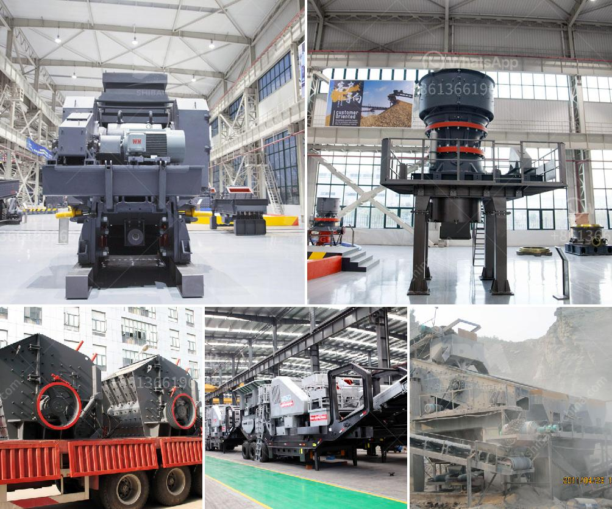

<h3>gravel crusher supplier in the philippines</h3>
Gravel and stone aggregates are an essential part of construction projects in the Philippines. With the numerous suppliers of these materials in the market, it is crucial to choose a reliable supplier that can provide high-quality aggregates at competitive prices. One reputable supplier in the country is the gravel crusher supplier located in the Philippines.

With a wide range of materials available, the supplier ensures that all construction projects are supplied with the right aggregates. These materials include crushed gravel, sand, and limestone that can be used in various applications such as road construction, building foundations, and landscaping.

One of the main advantages of choosing this supplier is the quality of their products. They source their aggregates from reliable quarries that adhere to strict quality control measures. This ensures that customers receive aggregates that are free from impurities and meet the required specifications for construction projects.

Furthermore, the gravel crusher supplier in the Philippines offers competitive prices. They understand the importance of providing cost-effective solutions to their clients. By offering affordable rates, they enable contractors, builders, and homeowners to complete their projects without exceeding their budget.

In addition to quality and affordability, the supplier also prides itself on excellent customer service. They have a team of knowledgeable and friendly staff who can assist customers in choosing the right aggregates for their specific needs. They also provide timely delivery services, ensuring that construction projects can proceed without delays.

Overall, the gravel crusher supplier in the Philippines is a reliable partner for any construction project. They offer high-quality aggregates at competitive prices and provide excellent customer service. Whether it is a small residential project or a large-scale infrastructure development, choosing this supplier ensures that you have the right materials to complete your construction project successfully.
<h3>Contact us</h3><ul><li><strong>Whatsapp:&nbsp;<a href="https://wa.me/8613661969651">+8613661969651</a></strong></li><li><a href="https://swt.shibang-china.com/?git&amp;zhl&amp;gravel crusher supplier in the philippines"><strong>Online Service(chat now)</strong></a></li></ul><h3>Related</h3><ul><li><a href='price of conveyor belts.md'>price of conveyor belts</a></li><li><a href='silica sand production using ball mill in dubai.md'>silica sand production using ball mill in dubai</a></li><li><a href='crusher plant operator in crusher.md'>crusher plant operator in crusher</a></li><li><a href='gold mining mining gold mining cost.md'>gold mining mining gold mining cost</a></li><li><a href='price 200 crusher price.md'>price 200 crusher price</a></li></ul>