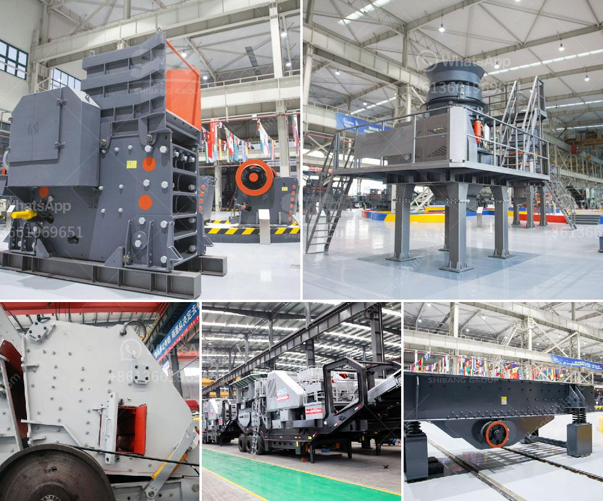

<h3>gravel crushers in bc</h3>
Gravel crushers are machines that break down rocks into smaller pieces, making it easier to create construction materials such as gravel. With their ability to crush hard and abrasive materials, gravel crushers play a crucial role in many construction projects throughout British Columbia (BC). In this article, we will explore the importance of gravel crushers in BC and their contribution to the construction industry.

BC is known for its vast natural resources, including an abundance of gravel deposits. These deposits are crucial for constructing roads, highways, buildings, and other infrastructure projects. Gravel crushers are the primary crushing equipment utilized to turn these raw materials into usable construction aggregate.

One of the main advantages of gravel crushers is their ability to produce a consistent and quality product. They can process various types of rocks, including limestone, granite, and basalt, into different sizes of gravel. This versatility ensures that construction projects can obtain the specific type and size of gravel they need promptly.

Moreover, gravel crushers are designed to handle tough materials. Their robust construction allows them to withstand extreme forces and resist wear and tear. This makes them ideal for crushing even the hardest rocks, ensuring durability and longevity of the machinery.

Additionally, gravel crushers in BC are often equipped with advanced features to enhance productivity and safety. Many machines come with automated control systems that regulate the feeding process, adjust settings, and monitor the overall operation. This automation not only improves efficiency but also reduces the risk of human error.

Furthermore, modern gravel crushers are designed with safety in mind. They incorporate features such as safety guards, emergency stop buttons, and interlock systems to ensure the protection of workers. These safety measures are critical, especially in mining and quarrying operations, where the risk of accidents is higher.

The economic impact of gravel crushers in BC is significant. The construction industry heavily relies on gravel, and the availability of quality aggregate directly influences the pace and cost of construction projects. Having access to reliable and efficient gravel crushers ensures a steady supply of aggregate materials, driving the progress of BC’s construction sector.

Gravel crushers also contribute to environmental sustainability. By crushing rocks on-site, they eliminate the need to transport raw materials long distances, reducing carbon emissions and fuel consumption. Furthermore, recycling and reusing crushed gravel in construction projects minimize the pressure on natural resources and contribute to a more circular economy.

In conclusion, gravel crushers in BC are an indispensable tool for the construction industry. They provide the necessary machinery to process raw materials and create high-quality aggregates for various construction projects. Gravel crushers' ability to crush hard and abrasive materials, their advanced features, and their contribution to safety and sustainability make them essential assets for the construction industry in British Columbia.
<h3>Contact us</h3><ul><li><strong>Whatsapp:&nbsp;<a href="https://wa.me/8613661969651">+8613661969651</a></strong></li><li><a href="https://swt.shibang-china.com/?git&amp;zhl&amp;gravel crushers in bc"><strong>Online Service(chat now)</strong></a></li></ul><h3>Related</h3><ul><li><a href='cost for a metal crusher in kerala.md'>cost for a metal crusher in kerala</a></li><li><a href='components of the hammer crusher.md'>components of the hammer crusher</a></li><li><a href='manufacturers crushing stone.md'>manufacturers crushing stone</a></li><li><a href='mineral processing ball mills nigeria.md'>mineral processing ball mills nigeria</a></li><li><a href='stone crusher aggregate supplier kota.md'>stone crusher aggregate supplier kota</a></li></ul>