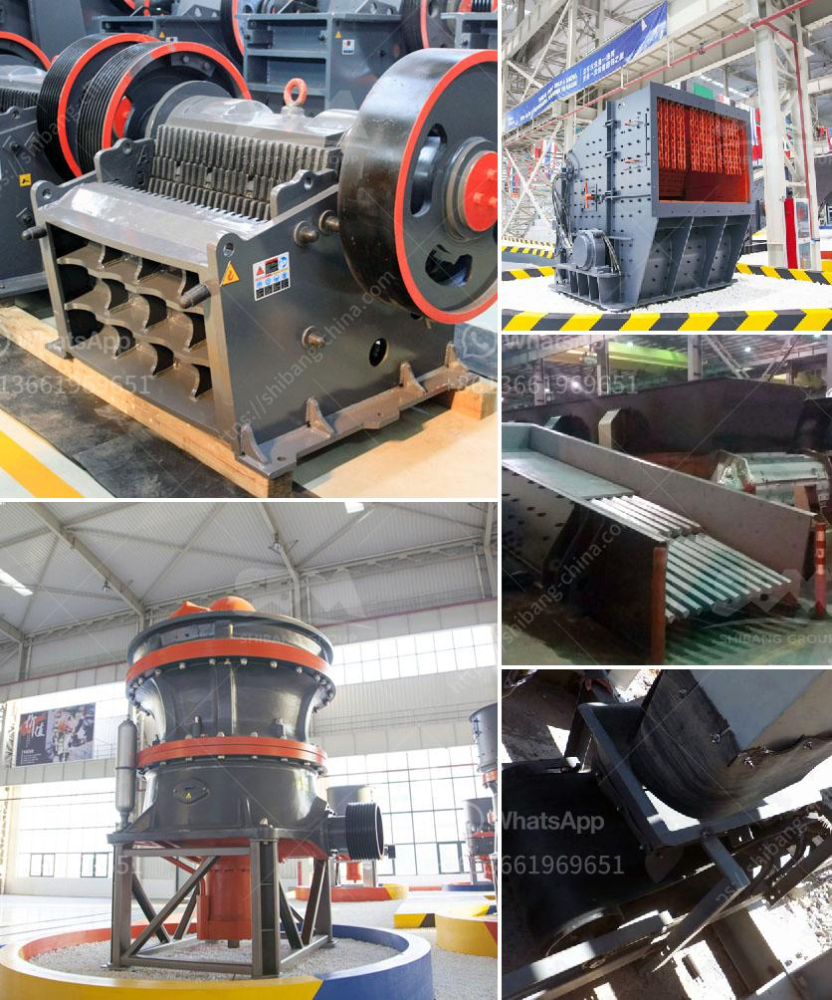

<h3>grinding ball mill price</h3>
A grinding ball mill is a type of grinder used to grind materials into extremely fine powder for use in mineral dressing processes, paints, pyrotechnics, ceramics, and selective laser sintering. The development of grinding ball mills has increased the productivity in many industries, making it an essential investment for companies that rely on efficient material processing.

One crucial aspect that businesses consider before purchasing a grinding ball mill is the price. The cost of a grinding ball mill can vary depending on several factors such as the size of the mill, the materials being used, its durability, and the technology used in its construction. However, with the increasing demand for grinding ball mills, the market offers a wide range of prices that can suit various budgets.

When assessing the price of grinding ball mills, it is essential to consider the long-term benefits it can bring to your business. A well-designed and high-quality grinding ball mill can significantly increase production output, improve product quality, and reduce operating costs. It can also minimize downtime, ensuring a continuous and reliable material processing operation.

Investing in a reliable grinding ball mill can lead to substantial savings in energy consumption. Modern grinding ball mills are engineered to be highly efficient, requiring minimal energy input to achieve the desired particle size reduction. This not only helps businesses reduce their carbon footprint but also contributes to significant cost savings in the long run.

Grinding ball mills are also versatile machines that can accommodate various materials and grinding modes. Whether it is dry or wet grinding, batch or continuous operation, a good-quality ball mill can handle different processing needs, providing businesses with flexibility and adaptability.

Another factor that affects the price of grinding ball mills is the level of automation and technology involved. Advanced grinding ball mills come with cutting-edge features such as automatic control systems, real-time monitoring, and data analysis capabilities. These features enhance operational efficiency, reduce human error, and provide valuable insights for process optimization. Although mills with more advanced technology may have a higher upfront cost, the long-term benefits can far outweigh the initial investment.

In conclusion, the price of a grinding ball mill should not be the sole consideration when making a purchase decision. While affordability is important, investing in a reliable, efficient, and high-quality grinding ball mill can bring numerous benefits to your business, including increased productivity, improved product quality, reduced operating costs, and energy savings.

When evaluating different grinding ball mill prices, it is crucial to consider the long-term advantages it can offer rather than focusing solely on the upfront cost. By choosing a grinding ball mill that suits your specific needs and budget, you can make a sound investment that will drive your business forward and enhance your competitive edge in the market.
<h3>Contact us</h3><ul><li><strong>Whatsapp:&nbsp;<a href="https://wa.me/8613661969651">+8613661969651</a></strong></li><li><a href="https://swt.shibang-china.com/?git&amp;zhl&amp;grinding ball mill price"><strong>Online Service(chat now)</strong></a></li></ul><h3>Related</h3><ul><li><a href='diagram of a typical hammer mill.md'>diagram of a typical hammer mill</a></li><li><a href='ceramic crusher machine.md'>ceramic crusher machine</a></li><li><a href='small ball mill for alumina.md'>small ball mill for alumina</a></li><li><a href='silica sand pulverizer.md'>silica sand pulverizer</a></li><li><a href='quartz crusher plant cost.md'>quartz crusher plant cost</a></li></ul>