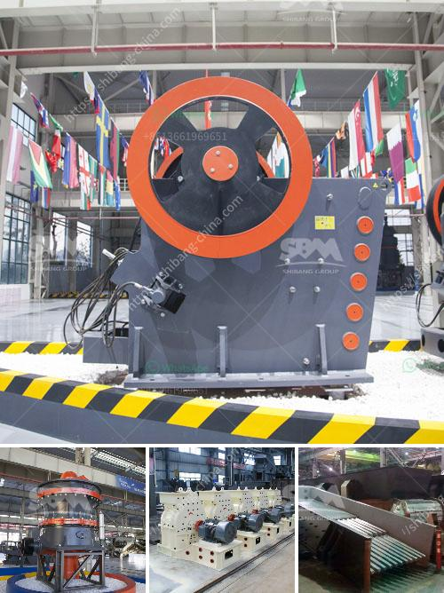

<h3>grinding ball mills type p500</h3>
In the world of industrial processes, grinding plays a crucial role. It is a process that directly affects the quality and consistency of the final product. To ensure optimal results, companies rely on grinding machines like ball mills. Today, we will shed light on one particular type of ball mill - the P500 - which has proven to be a game-changer in the industry.

The P500 grinding ball mill is an advanced technology used to grind materials as diverse as minerals, cement, chemicals, and ores. Its versatility allows it to be used in a wide range of applications, making it a reliable solution for numerous industries. Let us take a closer look at why the P500 is considered an excellent choice for grinding processes.

One key feature of the P500 is its efficiency. The design incorporates state-of-the-art engineering to minimize energy consumption and maximize productivity. This results in significant cost savings for businesses, as it reduces their energy bills without compromising on the quality of the ground material.

Furthermore, the P500 is engineered with robust materials that withstand high grinding pressures, ensuring durability and longevity. This is a crucial factor in maintaining a high level of operational efficiency, as companies can minimize downtime due to equipment failure or maintenance.

Another notable attribute of the P500 is its user-friendly interface. Advanced automation and control systems make it easy to operate, even for less experienced personnel. The mill's controls allow for precise adjustments of parameters such as speed, grinding time, and material feed. These features enable operators to optimize the grinding process, resulting in consistent and high-quality output.

Additionally, the P500's design takes into account the importance of safety. With protective guards and advanced safety features, it ensures a secure working environment for operators. Safety is a priority in any industrial setting, and the P500 takes it seriously, providing peace of mind for both management and employees.

When it comes to maintenance, the P500 ball mill significantly reduces the need for frequent servicing. Its innovative design minimizes the risk of breakdowns, and maintenance intervals are extended, allowing businesses to focus on what matters most - their core operations. Efficient maintenance also translates to reduced downtime, leading to increased productivity and higher overall profitability.

In conclusion, the P500 grinding ball mill offers numerous advantages that enhance efficiency and productivity in industrial grinding processes. From its energy-saving capabilities and durable construction to its user-friendly operation and focus on safety, this type of ball mill ticks all the right boxes.

Companies across various industries can greatly benefit from the P500, whether they are involved in mineral processing, cement production, or any other grinding-intensive activity. With its advanced technology, the P500 consistently delivers high-quality ground material while reducing operational costs.

In a competitive business landscape, having the right grinding equipment is crucial. The P500 grinding ball mill proves to be a worthy investment for companies seeking to optimize their grinding processes and achieve higher levels of efficiency and productivity.
<h3>Contact us</h3><ul><li><strong>Whatsapp:&nbsp;<a href="https://wa.me/8613661969651">+8613661969651</a></strong></li><li><a href="https://swt.shibang-china.com/?git&amp;zhl&amp;grinding ball mills type p500"><strong>Online Service(chat now)</strong></a></li></ul><h3>Related</h3><ul><li><a href='sand screening machine in malaysia.md'>sand screening machine in malaysia</a></li><li><a href='crushing machine manufacturers china.md'>crushing machine manufacturers china</a></li><li><a href='equipment used in limestone mining.md'>equipment used in limestone mining</a></li><li><a href='how to design stone crusher building.md'>how to design stone crusher building</a></li><li><a href='stone crushing machine manufacturers.md'>stone crushing machine manufacturers</a></li></ul>