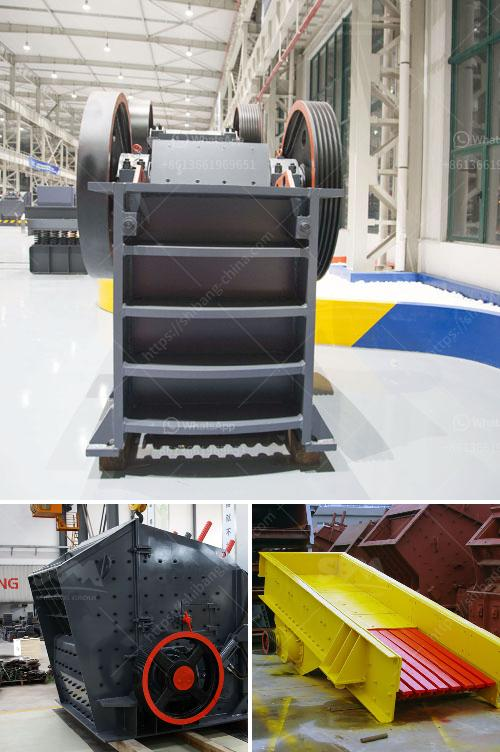

<h3>grinding machine capacity 1tph stone crusher machine</h3>
Grinding machines are powerful and versatile tools that are used to remove unwanted material from various surfaces. They are commonly used in the manufacturing and construction industries for shaping and smoothing surfaces. One particular type of grinding machine that is gaining popularity is the stone crusher machine. These machines are widely utilized in the mining industry for reducing the size of stones and minerals into smaller pieces.

Stone crusher machines come in different capacities. For instance, some are able to crush 1tph, while others 10tph, 100tph, or even more. Whether you are processing raw materials for a mining operation, or just for personal use at home, these machines can do the job efficiently and effectively.

The capacity of a stone crusher machine is determined by various factors, including the physical properties of the material being crushed, the feed size of the stone, the desired product size, and the size of the crusher used. These machines can operate in extremely harsh environments and handle even the toughest materials.

With a capacity of 1tph, a stone crusher machine can deliver a consistent and uniform final product. This is important for ensuring the quality and consistency of construction materials such as road base, aggregates, and concrete. A 1tph stone crusher machine can easily produce small sized stones of varying sizes, making it suitable for a wide range of applications.

Stone crusher machines with a capacity of 1tph are also cost-effective. They are often more affordable than larger capacity machines, making them a popular choice for small-scale operations or individuals looking to crush stones for personal use. Additionally, these machines consume less energy and require lower maintenance, resulting in reduced operational costs.

In conclusion, stone crusher machines with a capacity of 1tph offer a cost-effective and efficient solution for crushing stones and minerals. Whether you need to process raw materials for a mining operation or are simply looking to crush stones for personal use, these machines provide a reliable and versatile solution. With their ability to handle even the toughest materials and deliver consistent and uniform products, they are a great addition to any operation.
<h3>Contact us</h3><ul><li><strong>Whatsapp:&nbsp;<a href="https://wa.me/8613661969651">+8613661969651</a></strong></li><li><a href="https://swt.shibang-china.com/?git&amp;zhl&amp;grinding machine capacity 1tph stone crusher machine"><strong>Online Service(chat now)</strong></a></li></ul><h3>Related</h3><ul><li><a href='used quarry equipment from usa.md'>used quarry equipment from usa</a></li><li><a href='calculation of production mobile crushers.md'>calculation of production mobile crushers</a></li><li><a href='top german mining equipment manufacturers.md'>top german mining equipment manufacturers</a></li><li><a href='distributor stone crusher di indonesia.md'>distributor stone crusher di indonesia</a></li><li><a href='stone crushing plant th hard rock.md'>stone crushing plant th hard rock</a></li></ul>