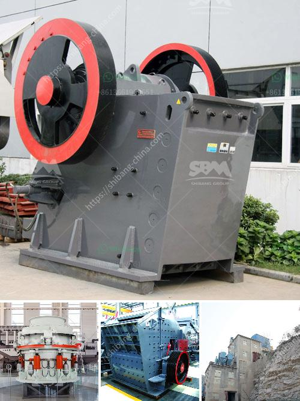

<h3>grinding machine for bentonite</h3>
Bentonite is an abundant and versatile mineral that is commonly used in various industries and applications due to its unique properties. One of its main uses is in the field of grinding and milling. Thanks to its ability to absorb water, bentonite is often used as a binding agent for grinding machines.

The grinding machine for bentonite has a wide range of applications and can be used for processing all kinds of non-metallic minerals. This machine has a strong market competitiveness, and has always been favored by customers. With its efficient grinding performance and outstanding production capacity, the bentonite grinding machine is highly cost-effective.

Bentonite is commonly used as a filler in the preparation of drilling fluids. It is also used as a suspension agent in the food industry due to its thickening and stabilizing properties. Other applications include the production of iron ore pellets, animal feed additives, plastics, and rubber products.

The grinding machine for bentonite has various grinding equipment, such as Raymond mill, vertical roller mill, ultra-fine mill and other equipment, which are tailored to meet the needs of customers of different fineness. The bentonite grinding machine equipment has the advantages of high grinding efficiency, low energy consumption, large grinding capacity, and strong adaptability to materials. It is an ideal choice for bentonite powder processing.

In addition to the above advantages, the grinding machine for bentonite also has the characteristics of easy operation, easy maintenance, and long service life. It adopts a full-enclosed design and operates under negative pressure, effectively preventing dust from overflowing. The advanced sealing device and sound-proofing measures ensure a clean and comfortable working environment.

In conclusion, the grinding machine for bentonite is an ideal choice for processing bentonite. It has the advantages of efficient grinding performance, low energy consumption, and large grinding capacity. It is an excellent investment choice for enterprises in various industries that require grinding and milling processes.
<h3>Contact us</h3><ul><li><strong>Whatsapp:&nbsp;<a href="https://wa.me/8613661969651">+8613661969651</a></strong></li><li><a href="https://swt.shibang-china.com/?git&amp;zhl&amp;grinding machine for bentonite"><strong>Online Service(chat now)</strong></a></li></ul><h3>Related</h3><ul><li><a href='small rock crusher machine for sale.md'>small rock crusher machine for sale</a></li><li><a href='vibrating screen supplier philippines.md'>vibrating screen supplier philippines</a></li><li><a href='hammer mill technical.md'>hammer mill technical</a></li><li><a href='stone crusher mills in mercadolibre.md'>stone crusher mills in mercadolibre</a></li><li><a href='small stone crusher supplier in the philippines.md'>small stone crusher supplier in the philippines</a></li></ul>