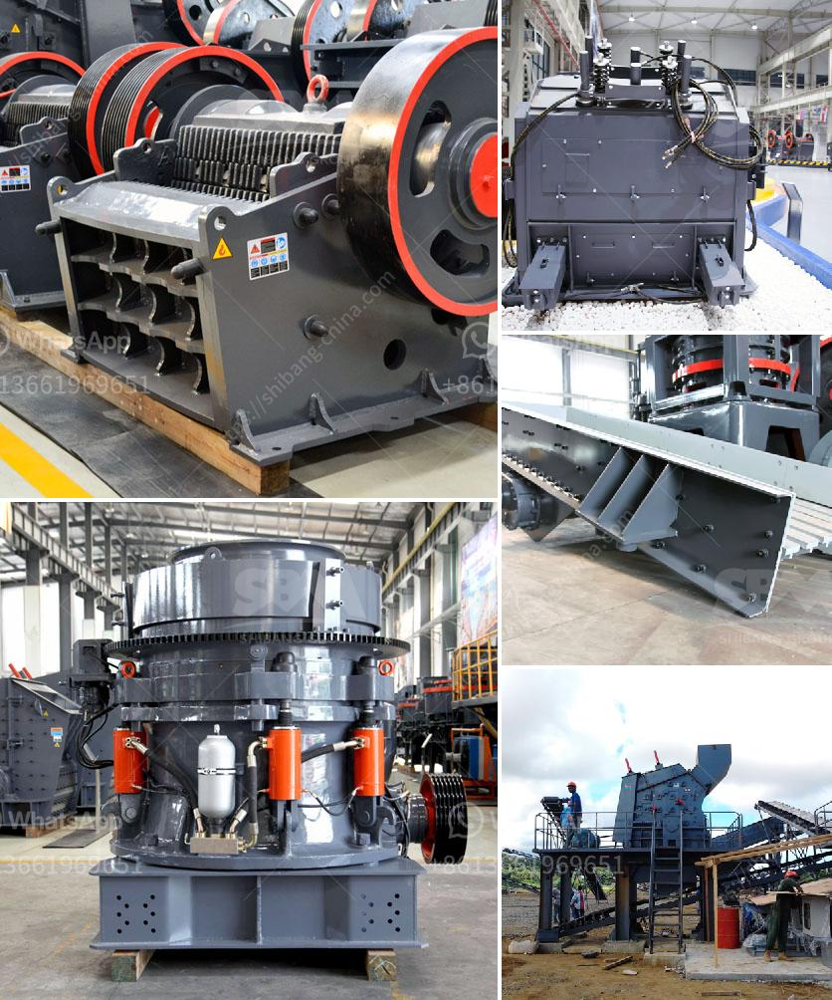

<h3>grinding machine for calciun carbinate from germany</h3>
Germany is one of the largest mineral producers worldwide, with one of the most advanced mining industries. From massive underground coal mines to vast deposits of minerals, the country has a rich history of extracting valuable resources from the Earth. One such resource is calcium carbonate, a versatile and essential mineral used in a variety of industries. In Germany, there is a highly efficient grinding machine that aids in the production of calcium carbonate.

Calcium carbonate is an essential mineral used in many industries, such as rubber, plastics, paint, paper, and construction. It is a fine, odorless powder with various beneficial properties. Adding calcium carbonate to products enhances their properties, such as strengthening rubber tires, improving the whiteness and opacity of paints, increasing the shelf life of food products, and even enhancing the absorbency of diapers.

The grinding machine for calcium carbonate from Germany is designed by Clirik Machinery, a renowned machinery manufacturer with comprehensive experience in mineral processing. It produces fine and ultrafine calcium carbonate powder suitable for use in various industries. The machine operates on the principle of impact and shear crushing, grinding the feed material between moving and stationary elements.

This German grinding machine utilizes advanced technology and innovative design features to provide efficient and reliable performance. It has a high-speed rotor with multiple wear-resistant impact plates that ensure thorough grinding of the calcium carbonate particles. The machine's internal classification system separates the fine particles from the coarse ones, resulting in a uniform and consistent product.

The Germany grinding machine for calcium carbonate also incorporates a precise temperature control system to maintain the integrity of the product during the grinding process. The company claims that this technology reduces energy consumption by 30%, improves grinding efficiency by 20%, and ensures a consistent and high-quality product.

Furthermore, the machine's compact design and low maintenance requirements make it a cost-effective solution for calcium carbonate production. It allows for easy installation and integration into existing production lines, reducing downtime and increasing overall productivity.

Clirik Machinery, the manufacturer of this grinding machine, prioritizes sustainability and adopts environmentally friendly practices. The machine incorporates a dust collection system that captures and filters fine particles, preventing them from being released into the atmosphere. It also features noise reduction technology, resulting in a quieter working environment.

In conclusion, the grinding machine for calcium carbonate from Germany is a highly efficient and reliable solution for calcium carbonate production. It combines advanced technology and innovative design to provide consistent and high-quality calcium carbonate powder. Its compact design, low maintenance requirements, and sustainability features make it an excellent choice for various industries in need of calcium carbonate. With Germany's long-standing reputation for excellence in machinery manufacturing, this grinding machine continues to contribute to the country's mineral extraction industry.
<h3>Contact us</h3><ul><li><strong>Whatsapp:&nbsp;<a href="https://wa.me/8613661969651">+8613661969651</a></strong></li><li><a href="https://swt.shibang-china.com/?git&amp;zhl&amp;grinding machine for calciun carbinate from germany"><strong>Online Service(chat now)</strong></a></li></ul><h3>Related</h3><ul><li><a href='roller crusher price list.md'>roller crusher price list</a></li><li><a href='sand washing equipment.md'>sand washing equipment</a></li><li><a href='diagram of a typical hammer mill.md'>diagram of a typical hammer mill</a></li><li><a href='slag powder grinding in india.md'>slag powder grinding in india</a></li><li><a href='dolomite production.md'>dolomite production</a></li></ul>